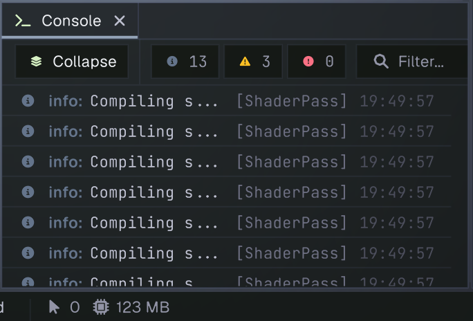

# Console

The Console collects messages generated by the editor, asset importers, scripts, and the running game. Check it for status information, warnings, and errors while working on a project.

Each row has a severity icon and message. Informational and success messages use the info filter; warnings and errors have separate filters. The numbers in the toolbar count messages currently held by the Console, including repeats that are grouped into one row. Messages can include a source label and timestamp.

## Filtering and display

Click the info, warning, or error count to show or hide that severity. Type in **Filter** to search message text. When no messages match the selected filters, the Console reports that there are no matching logs.

**Collapse** groups consecutive identical messages of the same severity and shows how many times they occurred. Turn it off to display each repeat as a separate row. Use the **⋮** menu to show or hide timestamps and to enable **Multi Line** display, which adds the first stack frame beneath a message when one is available.

Select a message row to display its full text, time, repeat count, and stack trace in the [Inspector](inspector.md). The row itself may shorten a long message to fit the available width; selecting it lets you read the complete message.

## Clearing and diagnosing issues

Select the trash button in the toolbar to clear the Console's current messages. This only clears the displayed log history; it does not fix the underlying issue or change project assets.

Warnings and errors often point to missing references, failed imports, or script problems. Start with the message and source label, then select the row to inspect its full stack trace. Script compilation errors are also reported here; use the source details to locate the script and line involved.
