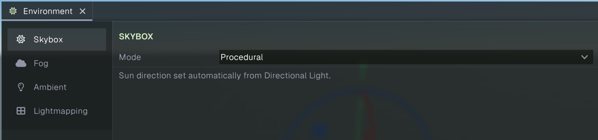
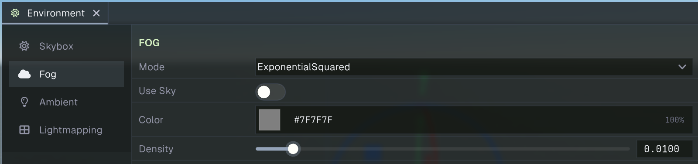
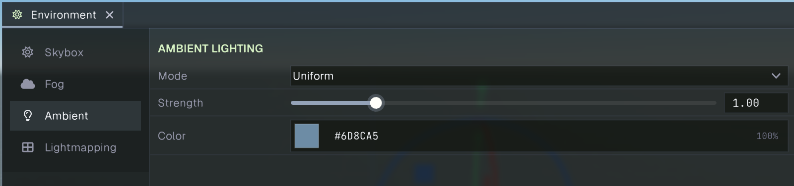
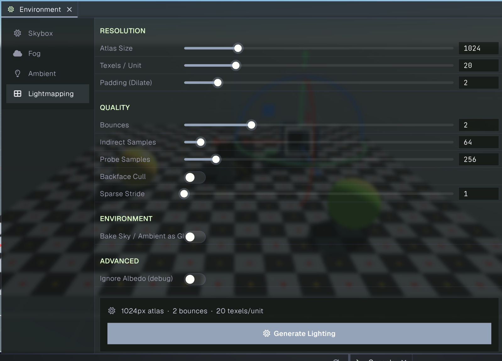

# Environment

The Environment panel configures scene-wide sky, fog, ambient lighting, and baked lightmapping. Open it from **Window > General > Environment**. Choose a category in the left sidebar; its controls appear in the scrollable area. The panel requires an open scene.

Environment values are stored with the scene. Changing a control marks the scene as modified, so save the scene to keep the changes.

## Skybox

The Skybox category controls the background rendered behind the scene and the scene’s sky appearance. **Mode** selects how the sky is drawn:

- **Solid Color** fills the sky with one **Color**.
- **Gradient** blends **Top Color** and **Bottom Color**. **Exponent** adjusts the shape of the transition.
- **Material** uses the selected **Material** asset to render the sky.
- **Procedural** generates a sky whose sun direction is set automatically from a Directional Light in the scene.

The available sky mode affects which controls are shown.

## Fog

Fog blends distant scene objects toward a selected color or the sky. **Mode** chooses the fog calculation:

- **Off** disables fog.
- **Linear** blends fog between **Start Distance** and **End Distance**.
- **Exponential** and **Exponential Squared** use **Density** to control how quickly fog accumulates with distance.

When fog is enabled, **Use Sky** takes the fog color from the sky. If enabled, **Sun Glow** controls whether the sun glow is included. If **Use Sky** is off, choose a **Color** directly. The panel shows only controls relevant to the selected mode.

## Ambient

Ambient lighting adds light across surfaces that are not directly lit. **Mode** chooses between:

- **Uniform**, which applies one **Color** throughout the scene.
- **Hemisphere**, which blends **Sky Color** and **Ground Color** according to surface orientation.

**Strength** controls the intensity of the ambient contribution.

## Lightmapping

Lightmapping bakes indirect lighting into a lightmap atlas for scene objects configured to use baked lighting. Set the bake parameters, then select **Generate Lighting**. While a bake is running, the panel shows its progress and provides **Cancel**. Once baked data exists, use **Clear** to remove it. The settings are disabled during an active bake.

### Resolution

- **Atlas Size** sets the lightmap atlas dimensions in pixels, from 256 to 4096.
- **Texels / Unit** controls lightmap detail per world unit. Higher values use more lightmap space.
- **Padding (Dilate)** sets the pixel padding around chart edges to help prevent seams, from 0 to 16.

### Quality

- **Bounces** sets how many times indirect light can bounce, from 0 to 8.
- **Indirect Samples** controls samples used for indirect lighting, from 1 to 1024.
- **Probe Samples** controls samples used when evaluating light probes, from 16 to 2048.
- **Backface Cull** skips back-facing geometry during the bake.
- **Sparse Stride** controls the spacing of sparse sampling, from 1 to 16.

### Environment and advanced options

- **Bake Sky / Ambient as GI** includes sky and ambient lighting in the baked indirect illumination.
- **Ignore Albedo (debug)** ignores material albedo during the bake, which can help inspect lighting independently of surface colors.

The bake card summarizes atlas size, bounce count, and texel density before generation. Generated lighting is scene data; save the scene after baking to retain it.

## Related guides

- [Scene view](scene.md) shows and edits the scene using the editor camera.
- [Game view](game.md) previews the scene through its active camera.
- [Camera](../graphics/camera.md) documents the camera component and its rendered output.
- [Project Settings](projectsettings.md) configures project-wide physics, navigation, time, audio, and asset behavior.
