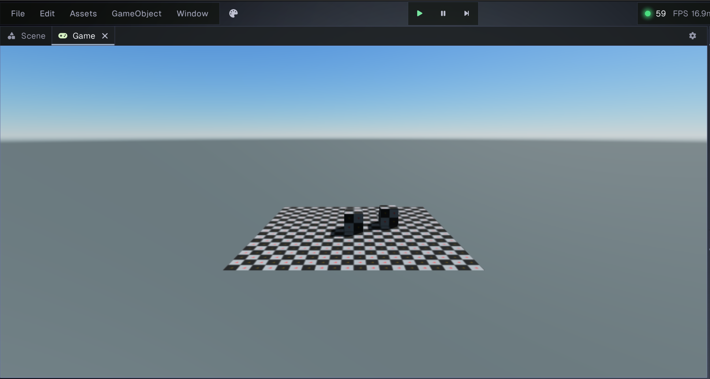
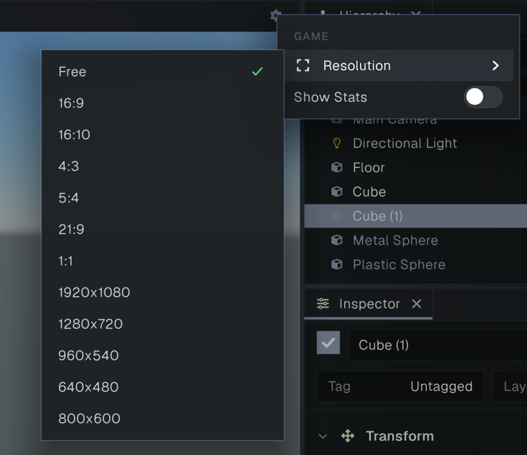

# Game view

The Game view shows the current scene as it appears through its active [camera](../graphics/camera.md). Unlike the [Scene view](scene.md), which uses an editor camera and supports selecting and arranging objects, the Game view displays the camera output. Use it to preview framing and rendering, and to interact with your game while it runs.

The screenshot shows the default scene from the active camera. The gear menu in the upper-right corner contains the resolution and statistics options. The Play, Pause, and Step controls are in the editor toolbar above the panel.

## Choose a preview size

Open the Game view’s **gear** menu and choose **Resolution**. Prowl offers these modes:

| Mode | What it does |
| --- | --- |
| **Free** | Matches the Game view panel’s current size. |
| **16:9**, **16:10**, **4:3**, **5:4**, **21:9**, **1:1** | Fits the selected aspect ratio inside the panel. Empty space around the image is letterboxed. |
| **1920x1080**, **1280x720**, **960x540**, **640x480**, **800x600** | Renders at the selected pixel dimensions, then fits the result inside the panel. |

The chosen mode is saved with the project’s editor settings and is reused when you reopen the Game view. Resize the panel to change the available preview area; fixed resolution modes keep their render dimensions.

## Run and interact with the game

Click **Play** in the editor toolbar to enter Play mode. Prowl starts a separate copy of the current scene, switches to the Game view, and runs gameplay scripts. Click inside the Game view to direct keyboard and mouse input to the game. While gameplay is running, keyboard and mouse input outside the Game view is filtered from gameplay scripts. Connected gamepads continue to send input regardless of Game view focus.

If gameplay locks or hides the cursor, press **Escape** to release it. Stopping Play mode restores the editor scene and makes the cursor visible and unlocked again.

Use the toolbar controls while playing:

| Control | Action |
| --- | --- |
| **Play / Stop** | Starts Play mode, or stops it and returns to the editor scene. |
| **Pause** | Pauses or resumes gameplay. |
| **Step** | Advances one frame while paused. |

Changes made to the running scene during Play mode are discarded when you stop. Stop Play mode before making changes you want to keep.

## Game statistics

To show performance information over the Game view, open the gear menu and select **Show Stats**. The overlay reports frame rate and frame time, render dimensions and camera count, and rendering details such as draw calls, batches, geometry, culling, lights, shadows, and post-processing when present. Select **Show Stats** again to hide the overlay.

## Related panels

- [Scene view](scene.md) is the editor camera view for selecting and arranging scene objects.
- [Camera](../graphics/camera.md) explains the component that determines the Game view output.
- [Hierarchy](hierarchy.md) lists the scene’s GameObjects.
- [Inspector](inspector.md) displays components and properties for the current selection.
