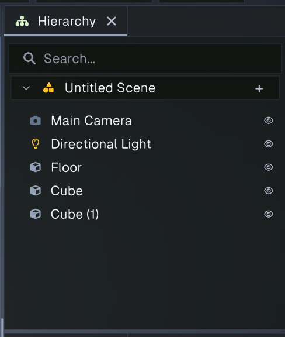
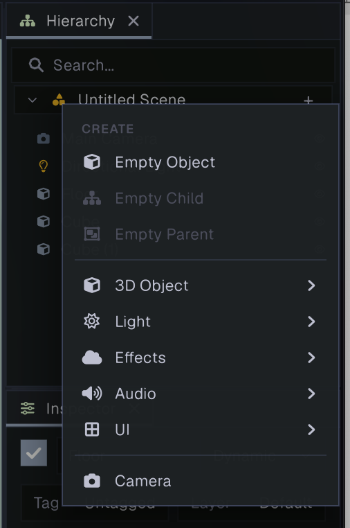
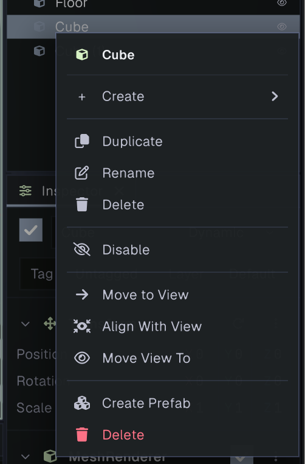

# Hierarchy

The Hierarchy lists the GameObjects in the current scene as a tree. It shows parent-child relationships, lets you select and organize objects, and provides a quick way to create common objects. Selecting an object here also selects it in the Scene view and displays its components in the [Inspector](inspector.md).

The default scene contains a **Main Camera**, **Directional Light**, **Floor**, and two cubes. The scene name appears in a collapsible header above the objects. Click its chevron to collapse or expand the scene tree.

## Select and find objects

- Click a row to select one GameObject. Its selection is reflected in the Scene view and Inspector.
- Hold **Ctrl** and click rows to add or remove individual objects from the selection. Hold **Shift** and click another row to select a range. On macOS, the editor displays **Command** for **Ctrl**; Shift remains the same.
- Double-click a row to select that object and frame it in the Scene view.
- Use the Search field at the top to filter objects by name. Matching descendants remain visible along with their parent rows so you can see where they sit in the tree.
- Click the eye icon at the right of a row to enable or disable that GameObject. Disabling a parent also disables its children in the scene. The change can be undone.

## Create GameObjects

Click the **+** button in the scene header or right-click empty space in the Hierarchy to open the Create menu. The same object commands are available from the **GameObject** menu in the main menu bar.

The menu includes:

- **Empty Object** creates a plain GameObject. From a row’s context menu, it is parented to that row. From the scene header’s **+** menu or the main **GameObject** menu, it is parented to the selected object, if there is one; otherwise, it is added at the scene root. From the empty-space right-click menu, it is always added at the scene root.
- **Empty Child** creates a plain child under the selected or context-menu GameObject. It is unavailable when there is no parent object.
- **Empty Parent** creates a new parent for the current selection, keeping the selected objects together as children. It is available when one or more objects are selected.
- **3D Object** creates primitives such as a cube, sphere, cylinder, plane, text mesh, or terrain.
- **Light** creates a directional, point, or spot light.
- **Effects** creates fog volumes or a particle system.
- **Audio** creates an audio source or listener.
- **UI** creates a canvas or common UI elements such as text, image, button, panel, slider, scroll view, toggle, rect mask, input field, and dropdown.
- **Camera** creates a camera GameObject.

New objects are selected and start in inline rename mode, so you can type a useful name immediately. Created objects are registered with Undo.

## Organize the scene tree

Drag a row up or down to change its sibling order. Drag it onto another GameObject to make it a child; the drop indicator shows whether the object will be placed above, below, or inside the target. Drag a row to empty space to make it a root object. Reparenting preserves the object’s world position, rotation, and scale. These changes can be undone.

Use the disclosure arrow beside a parent to show or hide its children. Parent-child relationships are useful for grouping objects that should move together. To group selected objects under a new empty object, choose **Empty Parent** from the Create menu.

## Context menu and shortcuts

Right-click a GameObject row to open actions for the selection. If you right-click without holding **Ctrl** or **Shift**, that row becomes selected first; with either modifier held, the existing multi-selection is kept. Depending on the selection and object type, the menu can include Create, Duplicate, Rename, Delete, Enable/Disable, camera alignment actions, Create Prefab, and prefab instance commands. Right-clicking empty space opens the Create menu.

For a single selected object, **Move to View** places it at the center of the Scene view without changing its rotation. **Align With View** places and rotates it to match the Scene camera. **Move View To** moves and points the Scene camera toward the object. **Create Prefab** makes a prefab asset from the selection. The red **Delete** item removes the object from the scene.

With the Hierarchy focused, the common shortcuts are:

| Action | Shortcut |
| --- | --- |
| Delete selected objects | **Delete** |
| Duplicate selected objects | **Ctrl+D** |
| Copy selected objects | **Ctrl+C** |
| Paste objects | **Ctrl+V** |
| Rename selected object | **F2** |
| Create an empty child under the selection | **Alt+Shift+N** |
| Create an empty parent around the selection | **Ctrl+Shift+G** |

On macOS, **Alt** is labeled **Option**, and **Ctrl** is labeled **Command** in displayed editor shortcuts. The shortcuts therefore appear as **Command+D**, **Command+C**, **Command+V**, **Option+Shift+N**, and **Command+Shift+G**. The keyboard shortcut settings can be changed in Preferences.

When a scene is not loaded, the Hierarchy shows a **New Scene** button. Creating a new scene loads the editor’s default scene.

## Related panels

- [Scene view](scene.md) lets you select and transform objects in the viewport.
- [Inspector](inspector.md) edits components and properties for the current selection.
- [Project browser](project.md) manages files and assets used by the scene.
