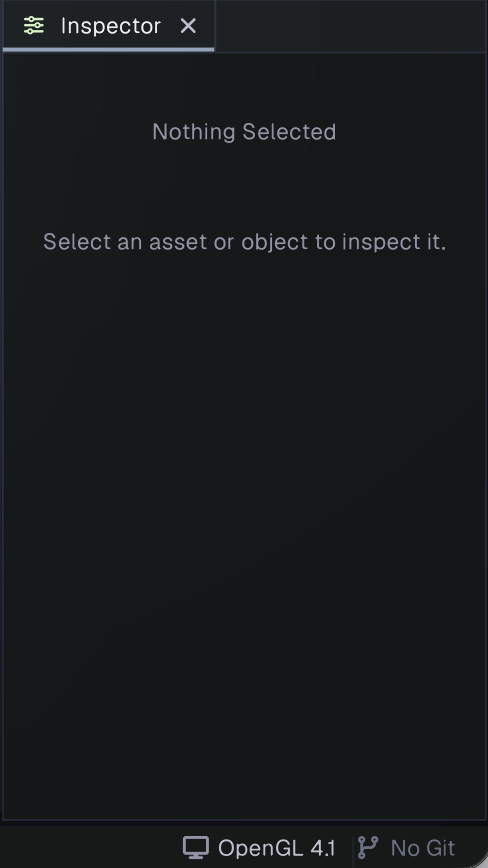
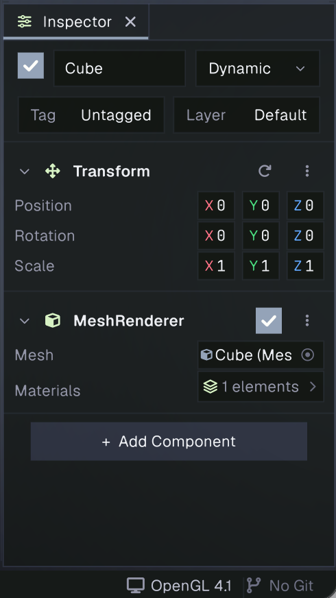
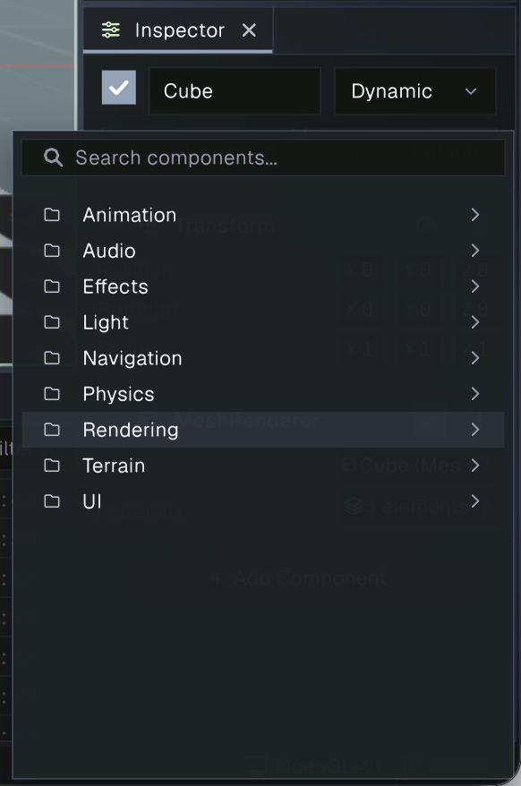

# Inspector

The Inspector displays details for the current selection. For a GameObject, it provides its object settings, Transform, and attached components. Select an object in the [Hierarchy](hierarchy.md) or Scene view to inspect it.

When there is no inspectable selection, the Inspector prompts you to select an asset or object. Selecting an asset in the [Project panel](project.md) displays its available information or editing controls instead. Selecting a folder does not clear the last inspected item while you browse.

## Inspecting a GameObject

The GameObject header contains these controls:

- **Enabled** checkbox: enable or disable the object.
- **Name** field: rename the object.
- **Static** menu: mark the object as static for systems that use static objects.
- **Tag** and **Layer** menus: assign the object's tag and layer.

Below the header, the Inspector lists the object's Transform and components. Expand or collapse a section by clicking its header. The Transform fields edit local position, rotation, and scale; its reset control restores position and rotation to zero and scale to one. Objects with a Rect Transform show layout-specific controls instead.

Each component has an enable checkbox and editable fields. The fields depend on that component: for example, a Mesh Renderer exposes its mesh and material references. Some components have a custom Inspector; others show editable fields automatically. Changes made in the Inspector participate in Undo.

Use the component's **⋮** menu for component actions such as Reset, Remove Component, and copy or paste. Reset restores a regular component's default values. For components inherited from a prefab, the menu can instead revert changes to the prefab version, or apply overrides when the prefab is editable. The Transform's reset control is separate from the component menu.

## Adding components

Select **Add Component** at the bottom of a GameObject's Inspector. Browse the component categories or search by name, then select a component to add it to the object. The addition can be undone. You can also drag a compatible C# script from the Project panel onto the Inspector to add it as a component.

## Multiple selection

When multiple GameObjects are selected, the Inspector shows shared controls and components found on every selected object. Fields with different values are marked **(mixed)**; editing a shared field applies the value to all selected objects. Components that are not present on every selected object are omitted.
