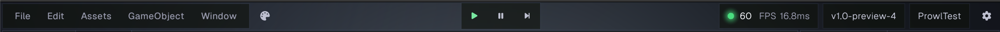
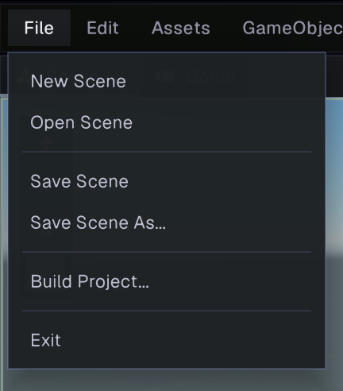
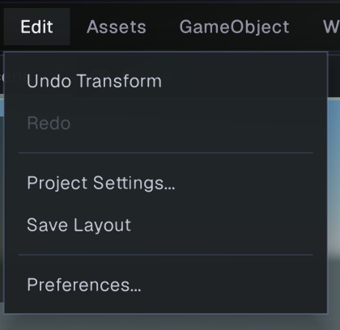
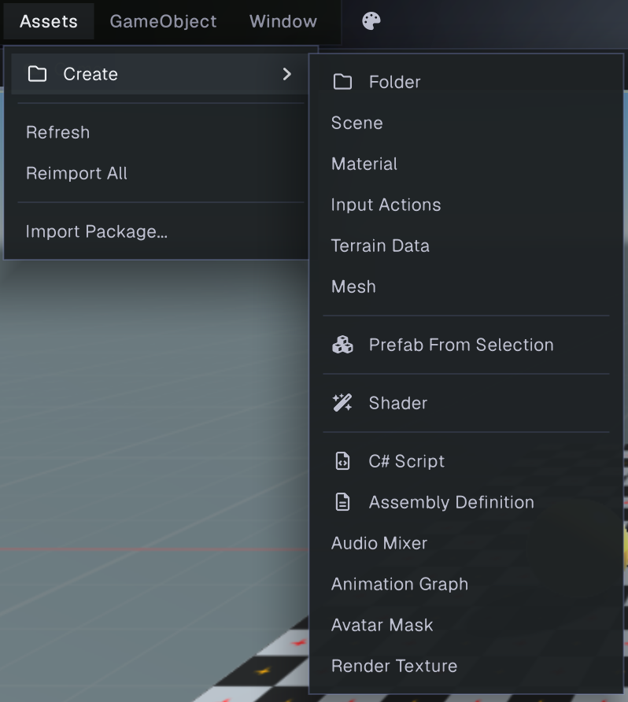
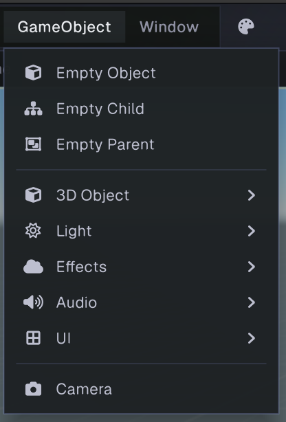
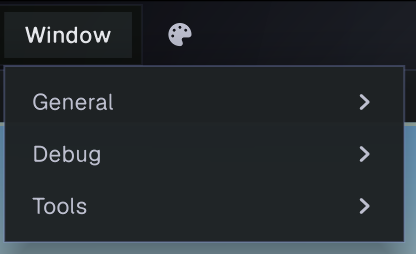

# Main menu

The main menu runs across the top of the editor. It provides commands for scenes, project assets, GameObjects, editor panels, and preferences. Some commands depend on the current selection or project. Extensions can also add commands to menus, so the exact contents of **Assets**, **GameObject**, and **Window** may vary.

## File

- **New Scene** creates a new scene.
- **Open Scene** opens a scene from the project.
- **Save Scene** saves the current scene. If it has not been saved before, Prowl asks for a path.
- **Save Scene As...** saves the current scene to a new path.
- **Build Project...** opens the build settings panel. See [Building](../getting-started/building.md).
- **Exit** closes Prowl.

## Edit

- **Undo** and **Redo** apply the next available history action. Their labels can show the action name, and they are disabled when no action is available.
- **Project Settings...** opens the project-wide settings panel. See [Project Settings](projectsettings.md).
- **Save Layout** saves the current dock and panel arrangement for the project.
- **Preferences...** opens user-level editor preferences. See [Preferences](preferences.md).

## Assets

- **Create** opens a submenu for creating project assets in the current Project panel folder. The built-in list includes folders, scenes, materials, input actions, terrain data, meshes, prefabs from the current selection, shaders, C# scripts, and assembly definitions. Other asset types can be added by extensions.
- **Refresh** refreshes the asset database.
- **Reimport All** reimports the project’s assets.
- **Import Package...** opens a file picker for a Prowl package (`.prowlpackage`).

## GameObject

GameObject commands create objects in the current scene. The **Empty Child** and **Empty Parent** commands use the selected object when possible. Submenus group built-in object types:

- **Empty Object**, **Empty Child**, and **Empty Parent** create basic objects and parent relationships.
- **3D Object** includes primitives such as cubes, spheres, cylinders, and planes, along with text and terrain objects.
- **Light** creates a directional, point, or spot light.
- **Effects** includes fog volumes and particle systems.
- **Audio** creates an Audio Source or Audio Listener.
- **UI** creates common interface objects such as canvases, text, images, buttons, panels, sliders, toggles, scroll views, input fields, dropdowns, and event systems.
- **Camera** creates a camera object.

The available object creators can vary when project code or extensions register additional menu items.

## Window

The **Window** menu groups editor panels and tools into submenus. **General** contains the standard panels, including Scene, Game, Hierarchy, Inspector, Console, Project, Environment, Project Settings, and Preferences. **Debug** and **Tools** contain diagnostic panels and utility windows; their entries may depend on the build and installed extensions.

Choose a panel to open it. Panels are dockable; drag their tabs to rearrange or float them. See [Editor interface](../getting-started/interface.md) for panel layout and docking.

## Toolbar theme shortcut

The palette button beside the menus opens Preferences directly to **Theme**. This is a shortcut to the theme controls described in [Preferences](preferences.md).
