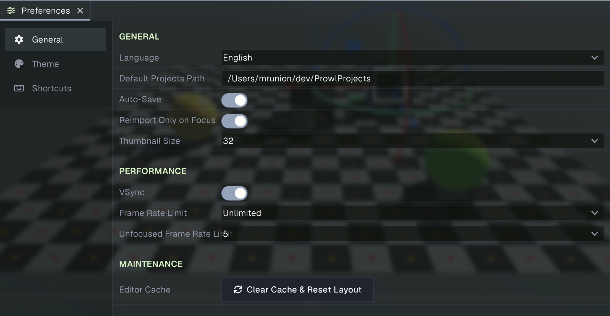
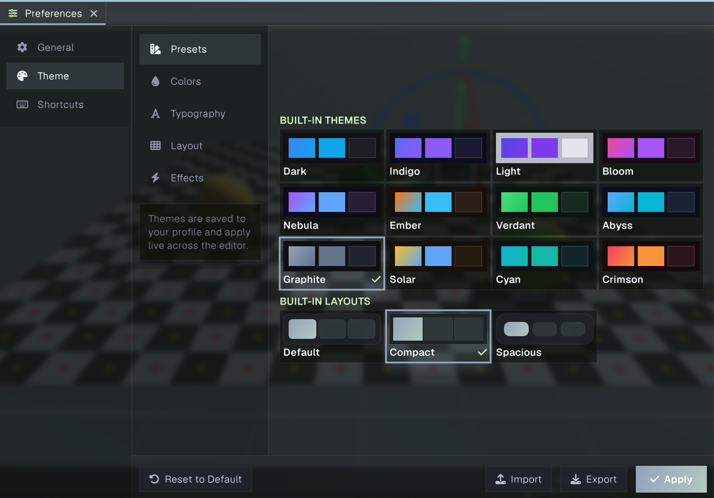
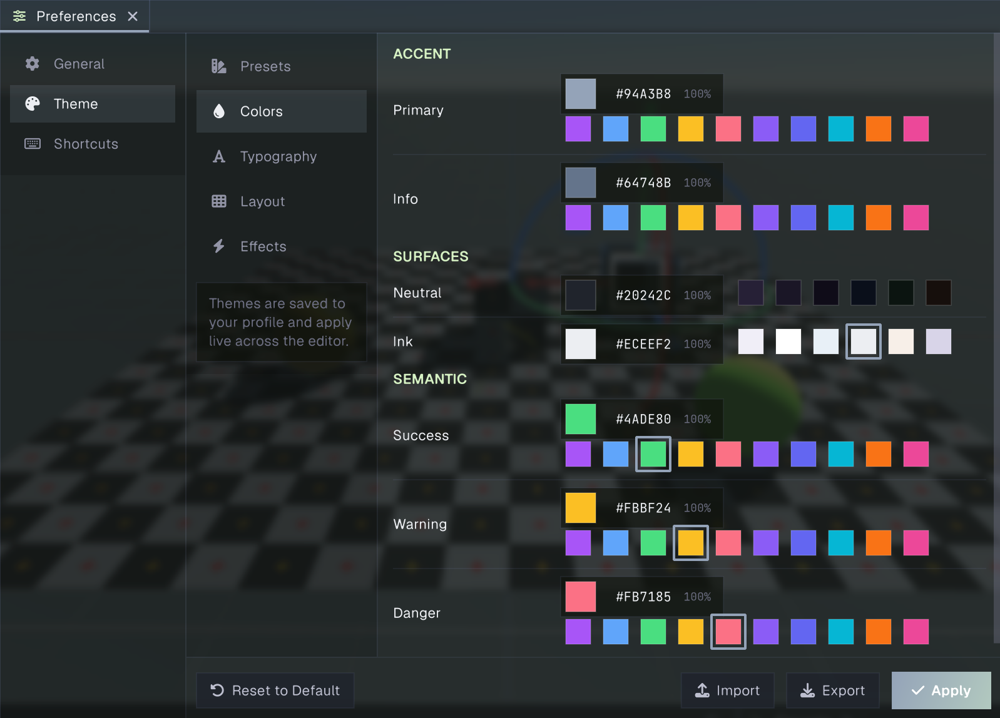
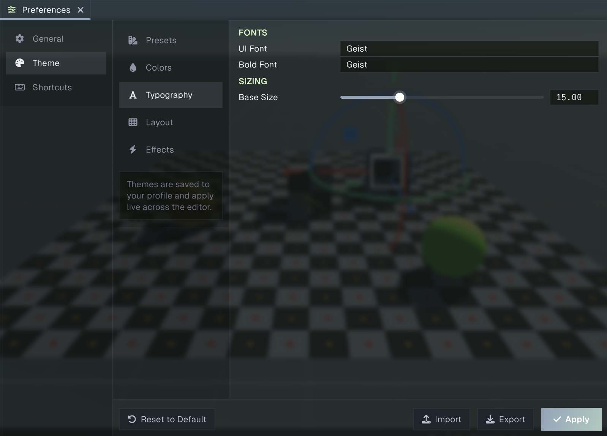
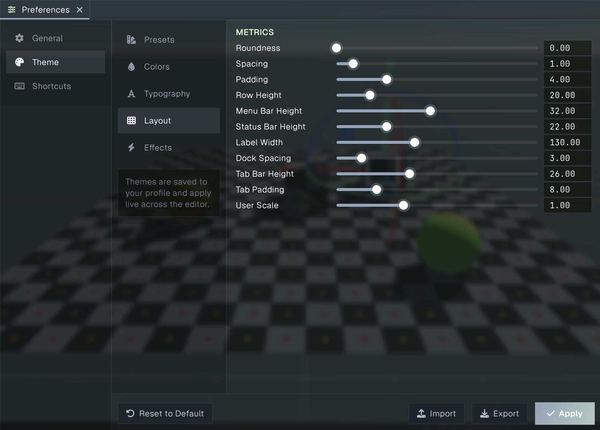
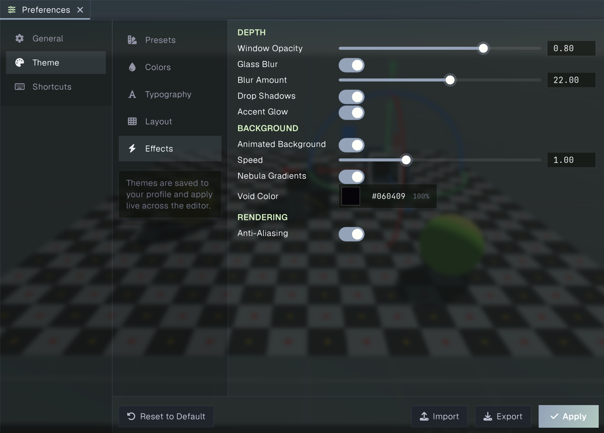
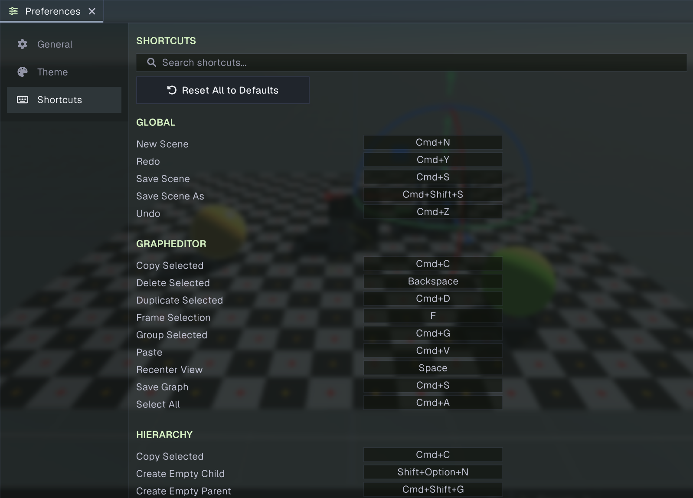

# Preferences

Preferences controls editor behavior and appearance for your user profile, across projects. Open it from **Edit > Preferences**, or choose **Window > General > Preferences**. The palette button beside the main menu opens the panel directly to **Theme**.

Choose **General**, **Theme**, or **Shortcuts** in the left sidebar. Theme has a second navigation rail for its five pages: Presets, Colors, Typography, Layout, and Effects. The panel can be resized and docked like other editor panels. Preferences are saved to your user settings rather than the project.

## General

### General settings

- **Language** changes the editor language.
- **Default Projects Path** sets the folder used as the default location when creating projects.
- **Auto-Save** controls automatic saving of the editor layout.
- **Reimport Only on Focus** delays asset reimport work until the editor window is focused. Turn it off to allow reimporting while the editor is in the background.
- **Thumbnail Size** sets Project panel asset thumbnail size to 32, 64, or 128 pixels. Changing it regenerates the thumbnail cache.

### Performance

- **VSync** makes the editor wait for the display before presenting a frame.
- **Frame Rate Limit** caps the editor’s focused frame rate at Unlimited, 30, 60, 120, 144, or 240 FPS.
- **Unfocused Frame Rate Limit** caps the frame rate while the editor window is not focused. Choose **Same as Focused**, or 5, 10, 15, 30, or 60 FPS.

These editor frame pacing options are ignored in Play mode; the running game controls its own pacing.

### Maintenance

Choose **Clear Cache & Reset Layout** to clear the editor cache and restore the default panel layout.

## Theme

The Theme category changes the editor’s colors, typography, sizing, and visual effects. Most controls apply their changes live. The live preview appears when the Preferences panel is wide enough. Theme changes are stored in your profile and apply across projects.

The theme footer provides **Reset to Default**, **Import**, **Export**, and **Apply**. Reset restores the built-in default theme. Import and Export use `.prowltheme` files. Apply explicitly applies and saves the current theme.

### Presets

Choose a built-in color theme or layout card to apply it. Theme cards change the editor’s color palette; layout cards set a coordinated group of size and spacing values. Selecting a layout does not change the color theme.

### Colors

The Colors page sets the editor’s accent, surface, and semantic colors. Each row shows the current color and a palette of swatches:

- **Accent:** Primary and Info.
- **Surfaces:** Neutral and Ink.
- **Semantic:** Success, Warning, and Danger.

### Typography

- **UI Font** sets the regular editor font name.
- **Bold Font** sets the bold editor font name.
- **Base Size** adjusts the main font size from 8 to 32.

### Layout

The Layout page adjusts editor dimensions and spacing:

- **Roundness** controls corner rounding.
- **Spacing** controls gaps between controls.
- **Padding** controls the space inside controls and panels.
- **Row Height** sets the height of standard rows.
- **Menu Bar Height** and **Status Bar Height** set the top and bottom bar sizes.
- **Label Width** sets the standard width reserved for setting labels.
- **Dock Spacing** sets spacing between docked panels.
- **Tab Bar Height** and **Tab Padding** adjust panel tab dimensions.
- **User Scale** scales the editor UI from 0.5 to 2.

### Effects

The Effects page controls visual depth, background, and rendering:

- **Window Opacity** sets editor window transparency.
- **Glass Blur** enables or disables blur behind translucent surfaces. **Blur Amount** appears when blur is enabled.
- **Drop Shadows** toggles panel and control shadows.
- **Accent Glow** toggles glow around accent-colored controls.
- **Animated Background** enables the animated nebula background. When enabled, **Speed**, **Nebula Gradients**, and **Void Color** are available.
- When the animated background is disabled, **Style** selects a static background type. Depending on the type, configure gradient colors, a solid color, or an image with fit mode, dimming, and fill color.
- **Anti-Aliasing** toggles anti-aliasing for editor rendering.

## Shortcuts

The Shortcuts page lists editor actions by category and shows their current key bindings. Use the search field to filter actions by name or category. Select a binding to start recording, then press the desired key with any modifier keys. Press **Escape** to cancel rebinding. Select **Reset** beside an overridden binding to restore its default, or choose **Reset All to Defaults** to clear all custom bindings.

Modifier names are platform-specific: **Ctrl** on Windows/Linux is shown as **Cmd** on macOS, and **Alt** on Windows/Linux is shown as **Option** on macOS. For example, the screenshot shows New Scene as `Cmd+N` on macOS.

## Related guides

- [Main menu](main-menu.md) describes the Preferences command and Theme shortcut.
- [Project Settings](projectsettings.md) covers settings saved with an individual project.
- [Editor interface](../getting-started/interface.md) explains panels, docking, and the main editor layout.
