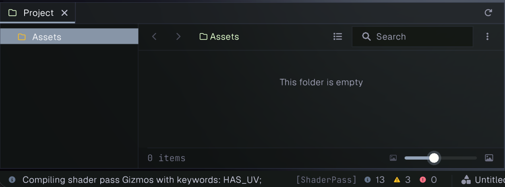
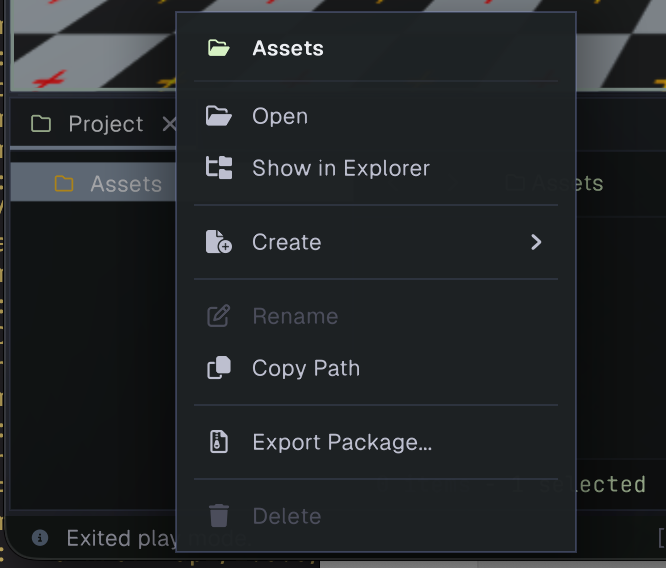
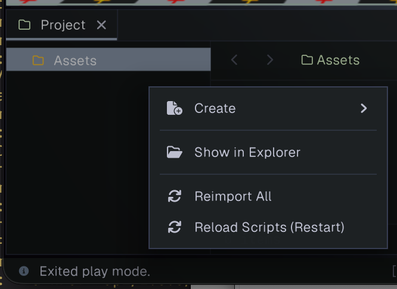

# Project

The Project panel browses the files and folders in the current project's `Assets` directory. Use it to find assets, create and organize project content, and open assets in their editor or preview.

To configure project-wide metadata and runtime settings, open [Project Settings](projectsettings.md) from **Edit > Project Settings**.

The panel has a folder tree on the left and the contents of the current folder on the right. Select a folder in the tree or use the breadcrumb path above the contents to navigate. The back and forward arrows revisit folders you have browsed. The refresh icon in the panel tab header rebuilds the asset database.

## Browsing and filtering

The right side can show assets as thumbnails or as a list. Use the view button to switch modes, or drag the slider in the footer to change thumbnail size; reducing it far enough switches to list view. The list shows each item's name, type, and size. Expand an asset with sub-assets to see its contained items.

Enter text in **Search** to filter the current folder. The options menu beside Search controls file extensions, grid/list view, sorting by name, type, size, or modified date, hidden files, and grouping by type. The footer shows the number of displayed items and the current selection count.

Click an item to select it. Use the platform's standard modifier-click and Shift-click gestures to add to or extend the selection. Double-click a folder to enter it; double-click an asset to open its registered editor, or the operating system's default application if Prowl has no editor for it. Double-click an asset with sub-assets to expand or collapse its sub-asset list.

## Creating and managing assets

Right-click an asset or folder to open its context menu. Right-click an empty area to open the folder-level menu. The available actions depend on what you click and select.

An item's menu can open it, show it in the system file browser, create content in the relevant folder, rename it, copy its path (or an asset's GUID), reimport an asset, export selected assets as a package, or delete the selection. Rename and delete are unavailable for the Assets root. Deleting asks for confirmation. The Assets root menu may not show every action available on an individual asset.

The background menu creates content in the current folder, opens that folder in the system file browser, reimports all assets, or reloads scripts. Reloading scripts restarts script compilation.

The **Create** submenu includes folders and project asset types such as scenes, materials, input actions, terrain data, meshes, prefabs from the current selection, shaders, C# scripts, and assembly definitions. The list can include additional types registered by the project or extensions. Newly created items are selected and enter rename mode.

You can also add files to the project's `Assets` directory with the system file browser; refresh the asset database if they do not appear. Drag assets between folders in the Project panel to move them. Dragging a GameObject from the Hierarchy into the Project panel creates a prefab in the target folder. Drag a compatible asset from this panel into another editor area, such as the Scene view or an Inspector reference field, to use it there.
