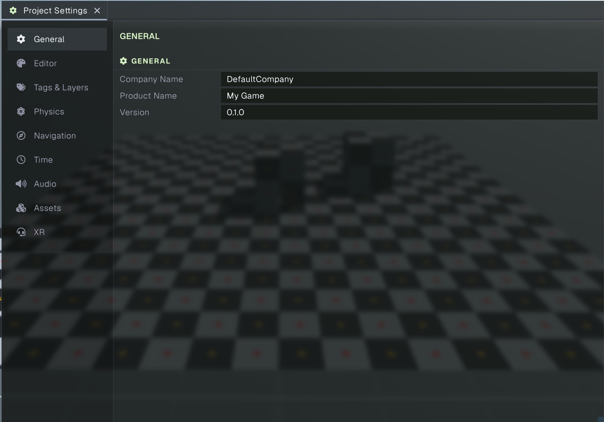
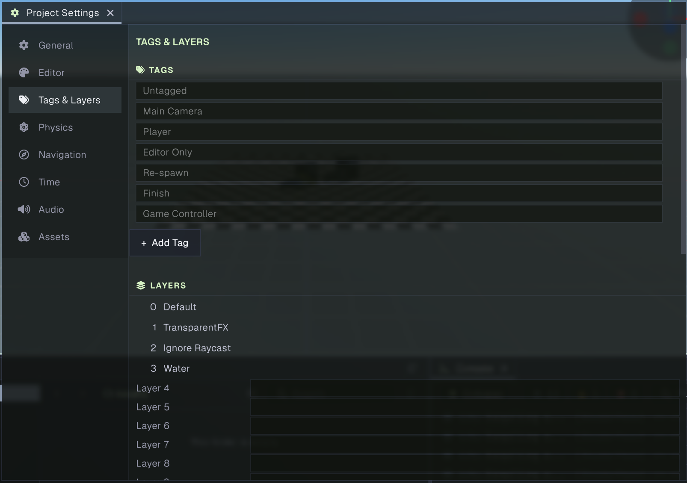
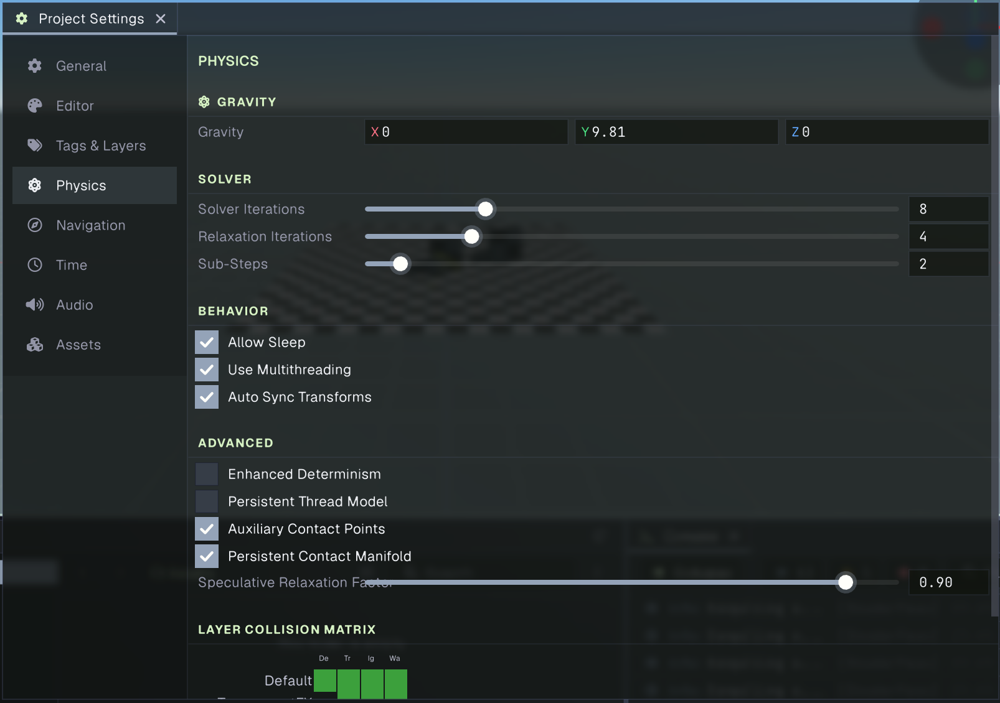
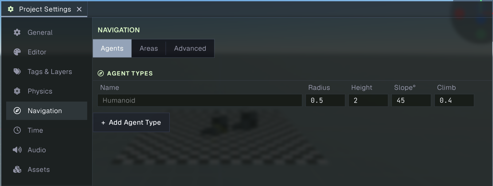
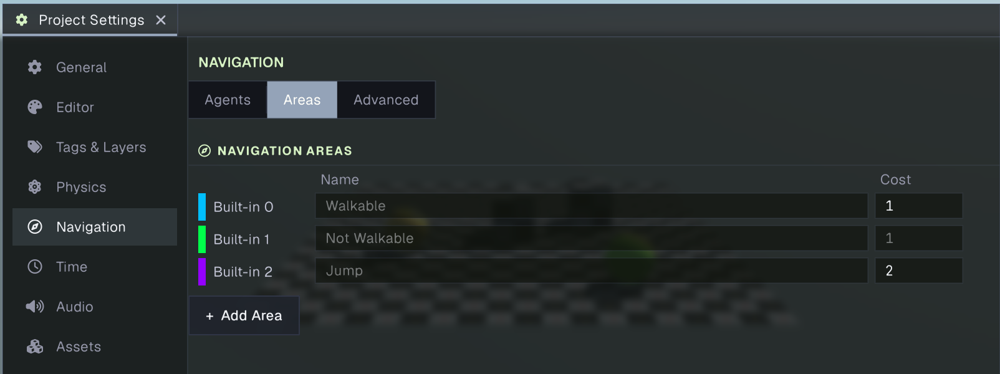
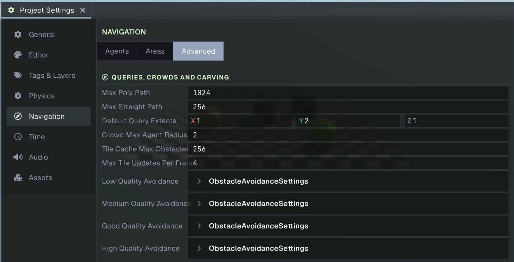
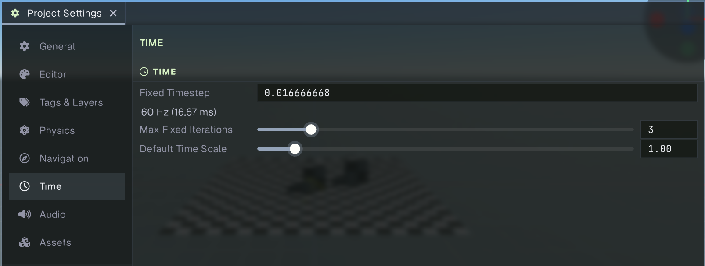
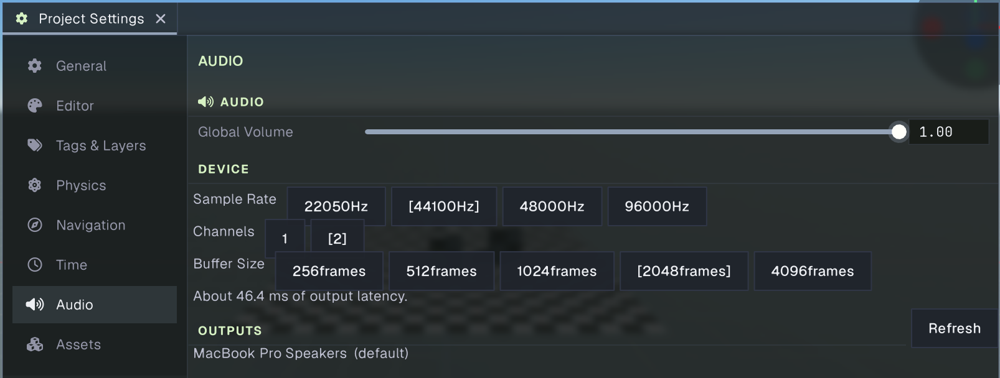
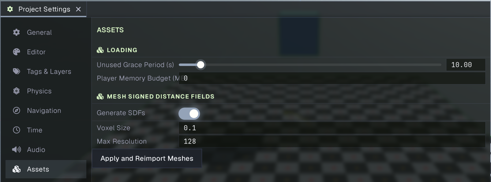
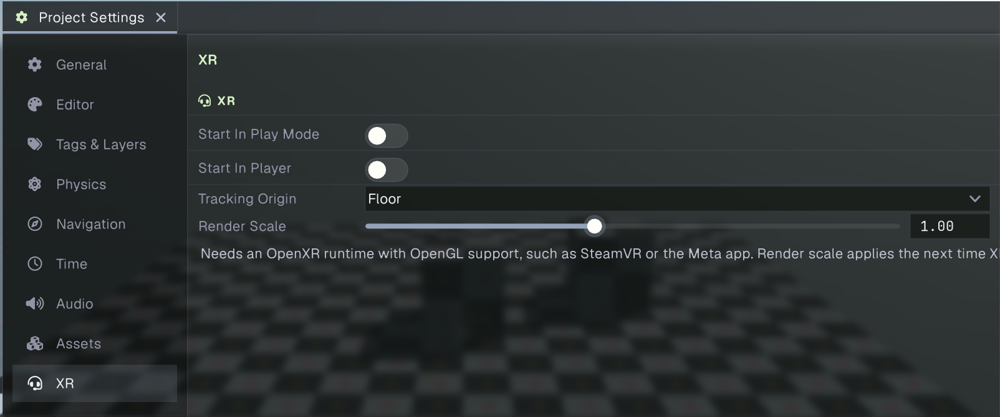

# Project Settings

Project Settings configures project-wide values used by the editor and the running game. Open it from **Edit > Project Settings**, or from the Project Settings shortcut in the project launcher. The panel is dockable like other editor panels. Choose a category in the left sidebar; its settings appear in the scrollable area on the right.

Settings are saved with the project under its `ProjectSettings` folder. Most changes apply while you edit them. Project settings can also be undone and redone with the editor’s normal Undo and Redo commands. The **Editor** category stores editor-only preferences; it is not included in player builds.

## General

The General page stores the project’s identifying information:

- **Company Name** is the company or publisher name associated with the project.
- **Product Name** is the game or product name.
- **Version** is the project’s version string.

These values provide project metadata for builds. The last opened scene is also remembered by the editor, but is not an editable field on this page.

## Editor

The Editor page stores per-project editor preferences. It currently has no visible controls in the Project Settings panel. The selected [Game view](game.md) resolution preset is also saved with these project editor settings, so the Game view uses the last selected preset next time.

## Tags & Layers

The Tags & Layers page defines names that can be assigned to GameObjects and used by project code and physics.

### Tags

The built-in tags at the top of the list are fixed. Use **Add Tag** to create a project tag, then edit its name in the new row. Tag names must be non-empty and unique. Use the **X** at the end of a custom tag row to remove it.

### Layers

Prowl provides 32 layer slots, numbered 0 through 31. The built-in layers in the first four slots are fixed; edit the names of the remaining slots to suit the project. Leave a slot blank when it is not in use. The [Physics](#physics) page uses these layer names in the collision matrix.

## Physics

Physics controls the project’s 3D simulation defaults. These settings are applied to the active scene and to scenes loaded afterward.

### Gravity

**Gravity** sets the global acceleration vector in world units per second squared. The default is `(0, -9.81, 0)`, which pulls objects downward along the Y axis. Change individual body settings on their components when an object needs different behavior.

### Solver

- **Solver Iterations** controls how many solver passes are used per frame. More iterations can improve constraint accuracy, with additional simulation cost.
- **Relaxation Iterations** controls extra solver passes used to stabilize constraints.
- **Sub-Steps** divides a frame’s physics simulation into smaller steps, which can improve accuracy at additional cost.

### Behavior

- **Allow Sleep** lets inactive rigid bodies stop being simulated until disturbed, reducing work.
- **Use Multithreading** enables multithreaded physics simulation.
- **Auto Sync Transforms** synchronizes transform changes between the physics engine and scene graph automatically.

### Advanced

- **Enhanced Determinism** enables additional measures for more repeatable simulation, with a performance cost.
- **Persistent Thread Model** keeps the physics thread persistent instead of using the regular per-frame thread model.
- **Auxiliary Contact Points** adds contact points that can improve collision stability at additional cost.
- **Persistent Contact Manifold** reuses contact information across frames to reduce contact generation work.
- **Speculative Relaxation Factor** adjusts relaxation for speculative contacts, from 0 to 1.

### Layer Collision Matrix

The matrix controls which named layers can collide with each other. Each square represents a pair of layers; click it to enable or disable collisions. The matrix is symmetric, so changing a pair updates both directions. Only named layers are shown. Configure the layer names on the [Tags & Layers](#tags--layers) page.

## Navigation

Navigation settings apply to navigation meshes, path queries, and navigation agents. The page has three tabs: **Agents**, **Areas**, and **Advanced**.

### Agents

Agent types describe the dimensions and movement limits used when building navigation meshes for different characters. The built-in **Humanoid** type is fixed. Select **Add Agent Type** to add another type, edit its name and values, or use **X** to remove a custom type.

- **Radius** is the agent’s horizontal clearance around obstacles.
- **Height** is the agent’s vertical clearance.
- **Slope°** is the steepest walkable surface angle.
- **Climb** is the maximum step height the agent can traverse.

Use matching agent types on navigation mesh surfaces and navigation agents so the baked mesh fits the characters that use it.

### Areas

Areas label regions of a navigation mesh and let pathfinding prefer or avoid them by cost. The built-in **Walkable**, **Not Walkable**, and **Jump** areas are fixed. Use **Add Area** to add a user area, edit its name and **Cost**, or delete it with **X**. Empty user slots are hidden. Area names must be unique, and costs are at least 1. The cost for **Not Walkable** is fixed because paths cannot traverse that area.

### Advanced

The **Queries, Crowds and Carving** section contains these controls:

- **Max Poly Path** limits how many navigation polygons a path query can cross. A path that exceeds the limit may be returned as partial.
- **Max Straight Path** limits the number of corners in a returned path. A path that fills the limit may be partial.
- **Default Query Extents** sets the X, Y, and Z half-extents used to find the nearest point on the navigation mesh for a query.
- **Crowd Max Agent Radius** sets the largest agent radius supported by crowd proximity grids. It is read when a crowd is created.
- **Tile Cache Max Obstacles** limits the number of obstacles a navigation mesh can carve at once.
- **Max Tile Updates Per Frame** limits how many tiles each navigation mesh can rebuild per frame while processing queued carving changes.
- **Low**, **Medium**, **Good**, and **High Quality Avoidance** expose the sampling and weighting values used for crowd obstacle avoidance at each quality level. Expand a row to edit its detailed values.

## Time

Time configures the project’s fixed update and startup time scale:

- **Fixed Timestep** is the duration in seconds between fixed updates. The page also displays the equivalent update frequency in hertz and milliseconds.
- **Max Fixed Iterations** caps the number of fixed updates processed in one frame. A higher cap can help catch up after a slow frame, but may increase frame time.
- **Default Time Scale** sets the starting time scale. `1` is normal speed, `0` pauses time, and values above `1` speed it up.

## Audio

Audio configures the project’s output level and audio device format:

- **Global Volume** sets the master output volume from 0 to 1.
- **Sample Rate** selects the device rate: 22050, 44100, 48000, or 96000 Hz. Clips with another rate are resampled.
- **Channels** selects mono or stereo output.
- **Buffer Size** selects the device buffer in frames. Smaller buffers can reduce latency but may increase dropouts; the audio device treats this as a hint.

The page estimates output latency from the selected buffer size and sample rate. **Outputs** lists playback devices reported by the system and marks the default device. The editor opens the system default device; use **Refresh** to update the list after devices change.

## Assets

Assets controls how long unused assets stay loaded and the player’s asset memory budget:

- **Unused Grace Period (s)** sets how many seconds an asset remains loaded after nothing references it. This can avoid reloading an asset that is used again shortly afterward.
- **Player Memory Budget (MB)** sets the loaded asset memory budget for a built game. When the budget is exceeded, unused assets can be freed earlier. Set it to `0` for no budget. The editor does not use this limit.

## XR

The XR page configures when the project starts an OpenXR session and how it renders to a headset:

- **Start In Play Mode** starts XR automatically when you enter Play Mode. Leave it off if your game code starts XR itself.
- **Start In Player** starts XR automatically when a built player launches.
- **Tracking Origin** selects the reference point for tracked poses. **Floor** measures height from the floor; **Seated** measures from the position where tracking starts.
- **Render Scale** scales the headset runtime's recommended eye resolution. Lower values reduce rendering cost and image detail; higher values increase both. The new scale applies the next time XR starts.

XR requires an OpenXR runtime with OpenGL support, such as SteamVR or the Meta app. The editor and built player use the configured tracking origin when starting XR automatically.

## Related guides

- [Project panel](project.md) browses and manages files in the project’s `Assets` folder.
- [Building](../getting-started/building.md) covers creating a player build.
- [Game view](game.md) explains the resolution preset saved in the Editor settings.
