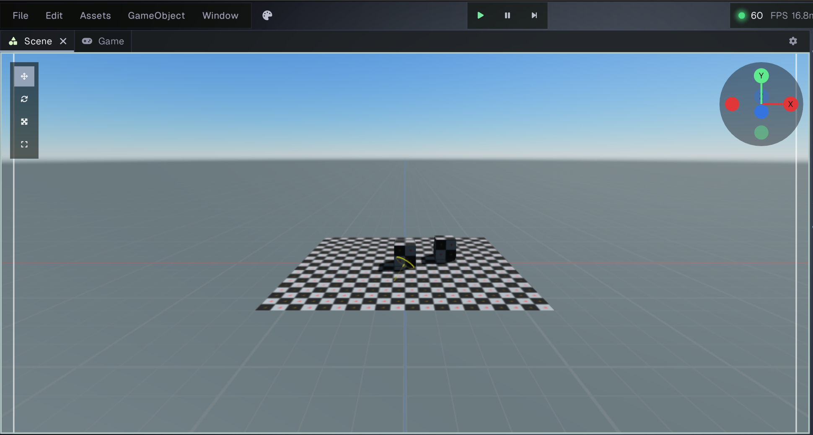
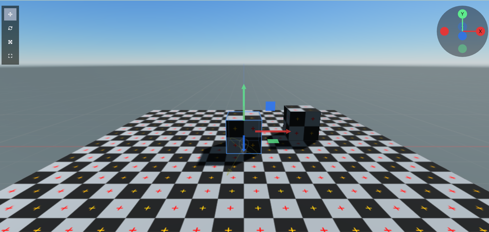
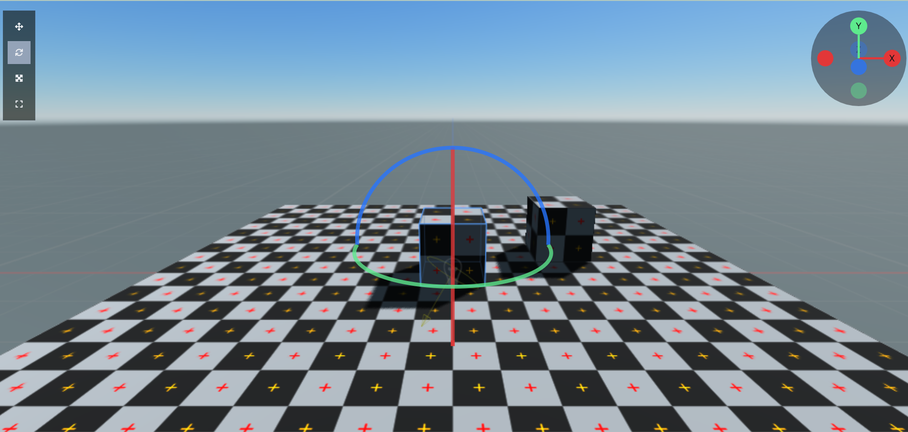
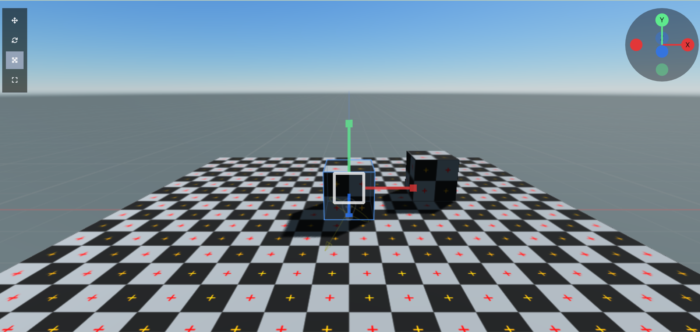
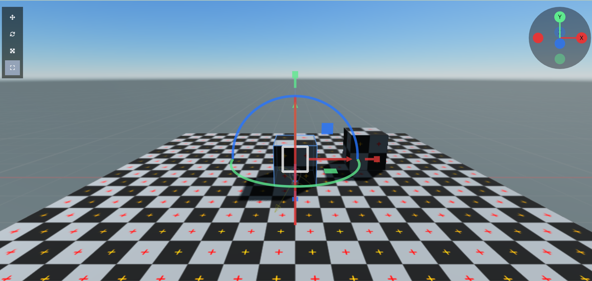
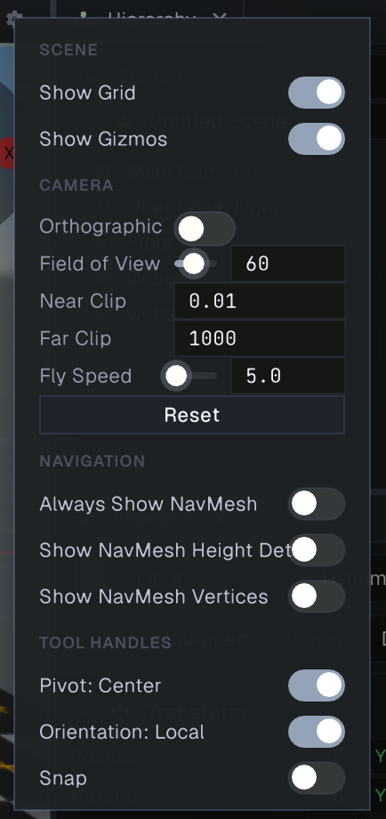

# Scene view

The Scene view is the editor workspace for viewing and arranging the current scene. It renders from an editor camera that you can move independently of the cameras in your game. Use it to inspect the scene from any angle, select objects, and manipulate their transforms. The Game view shows the scene from a game camera; see [Game view](game.md).

The screenshot shows the default scene from the editor camera. The view orientation widget is in the upper-right corner. The vertical toolbar on the left contains the Move, Rotate, Scale, and Universal transform tools. The Play, Pause, and Step controls in the application toolbar run the game; they are shared with the Game view and are not Scene camera controls.

## Select and frame objects

Click an object in the Scene view to select it. The selected object is also highlighted in the [Hierarchy](hierarchy.md), and its components appear in the [Inspector](inspector.md). You can also select objects from the Hierarchy.

Press **F** with the Scene view focused to move the editor camera toward the selection and frame it. This is useful when an object is outside the current view or too small to work with. Orbiting with an object selected also uses the selection as its pivot. With no selection, orbit uses a point in front of the camera.

Drag an asset from the [Project browser](project.md) into the Scene view to add it to the scene. The result depends on the asset type; for example, dropping a model creates an instance in the scene.

## Navigate the Scene camera

Focus the pointer over the Scene view to use these controls:

| Input | Action |
| --- | --- |
| **Alt** (Windows/Linux) or **Option** (macOS) + left-drag | Orbit around the current pivot. |
| **Alt** (Windows/Linux) or **Option** (macOS) + right-drag | Dolly toward or away from the pivot. |
| Mouse wheel | Dolly forward or backward in perspective mode; zoom in or out in orthographic mode. |
| Middle-drag | Pan the camera horizontally and vertically. |
| Right mouse button + mouse movement | Look around from the current position. |
| Right mouse button + **W**, **A**, **S**, **D** | Fly forward, left, backward, and right. |
| Right mouse button + **E** or **Space** | Fly upward. |
| Right mouse button + **Q** | Fly downward. |
| Right mouse button + **Shift** | Move three times faster while flying. |

While holding the right mouse button, scroll the wheel to adjust fly speed. Release the right mouse button to leave fly mode and release the cursor. Press **F** to focus the selection.

### View orientation widget

The axis widget at the upper right shows the editor camera’s orientation. Click an axis or axis marker to snap the view to that direction. Click the widget’s circular background to switch between perspective and orthographic projection. These actions move only the editor camera; they do not change a camera component in the scene.

## Transform tools

Select a GameObject to show its transform gizmo. Drag the colored axis or plane handles to modify its position, rotation, or scale in the scene. You can also edit the transform values in the Inspector.

The selected cube is outlined in blue. The Move gizmo’s red, green, and blue arrows move the object along the X, Y, and Z axes. The square handles between the arrows constrain movement to a plane. The axis widget in the upper-right corner shows how the view is oriented relative to the world axes.

Choose a tool from the vertical toolbar at the left edge of the Scene view, or use its keyboard shortcut while the view is focused. The letter shortcuts are the same on Windows, Linux, and macOS:

| Tool | Shortcut | Use |
| --- | --- | --- |
| **Move** | **W** | Drag an axis or plane handle to translate the selection. |
| **Rotate** | **E** | Drag a rotation ring to rotate the selection. |
| **Scale** | **R** | Drag an axis or center handle to scale the selection. |
| **Universal** | **T** | Show move, rotate, and scale handles together. |

The Rotate gizmo shows colored rings around the selection. Drag a ring to rotate around its corresponding axis. The ring colors follow the same red X, green Y, and blue Z convention as the axis widget.

The Scale gizmo uses colored axis handles to scale along one axis. Drag the center handle for uniform scaling across all axes.

The Universal gizmo displays move, rotate, and scale handles at the same time. Use it when you need to switch between transform operations without changing tools.

### Pivot and axis orientation

Open the Scene tab’s gear menu to choose the gizmo pivot and orientation:

- **Center** places the pivot at the center of the selection. **Pivot** uses the active object’s origin. This is most noticeable when transforming multiple selected objects.
- **Local** aligns gizmo axes to the active object’s rotation. **Global** aligns them to the world axes.

### Snapping

Hold **Ctrl** while dragging a transform handle to snap the movement, rotation, or scale. The Scene tab’s gear menu also has a sticky snapping toggle, which keeps snapping on without holding Ctrl. The default increments are 1 world unit for movement, 15 degrees for rotation, and 0.1 for scale.

## Scene display and settings

Select the gear at the right end of the Scene tab to open its settings menu.

### Scene display

- **Show Grid** toggles the editor grid and world axes over the scene.
- **Show Gizmos** toggles component and debug gizmos drawn over the Scene view, such as light or camera indicators. This setting also affects gizmos in the Game view.

### Camera

These settings change the editor camera used to navigate the Scene view. They do not change any Camera component in the scene.

- **Orthographic** switches between perspective and orthographic projection. In orthographic mode, objects do not appear smaller with distance. The **Field of View** control is replaced by **Size**, which sets the vertical span visible in the view.
- **Field of View** sets the perspective camera’s viewing angle. A wider value shows more of the scene; a narrower value magnifies the center of the view.
- **Near Clip** and **Far Clip** set the closest and farthest distances rendered by the editor camera. Objects outside this range are clipped.
- **Fly Speed** controls camera movement speed while navigating with the right mouse button held.
- **Reset** restores the editor camera lens defaults: perspective projection, 60-degree field of view, near clip 0.01, far clip 1000, and fly speed 5. It does not reset the camera’s position or orientation.

### Navigation

These options help inspect navigation meshes when the scene contains a baked NavMesh:

- **Always Show NavMesh** keeps the walkable NavMesh overlay visible. When off, the surface overlay is shown only while the NavMesh surface is selected.
- **Show NavMesh Height Detail** draws the detailed height contours of the NavMesh.
- **Show NavMesh Vertices** marks vertices in the NavMesh triangulation.

### Tool Handles

- **Pivot: Center** toggles between a shared center pivot for the selection and the active object’s own pivot.
- **Orientation: Local** toggles between axes aligned to the active object’s rotation (Local) and the world axes (Global).
- **Snap** toggles persistent transform snapping. You can also hold **Ctrl** while dragging a gizmo; on macOS, use the **Control** key (not Command).

The Scene view saves its camera position, lens, grid and gizmo visibility, and NavMesh display options with its panel state. The pivot, orientation, and snapping choices are editor-session tool settings. To adjust a camera used by the game, select its GameObject and edit the Camera component in the Inspector.

## Related panels

- [Game view](game.md) previews the scene through a game camera.
- [Hierarchy](hierarchy.md) lists scene objects and their parent-child structure.
- [Inspector](inspector.md) displays and edits the selected object’s components.
- [Project browser](project.md) lists the project’s files and assets.
