# Camera

A Camera component defines the view used to render a scene. Add one to a GameObject with **GameObject > Camera**, or use the Inspector's **Add Component** menu and choose **Rendering > Camera**. Position and rotate the GameObject to frame the scene; the camera uses its transform as the view point.

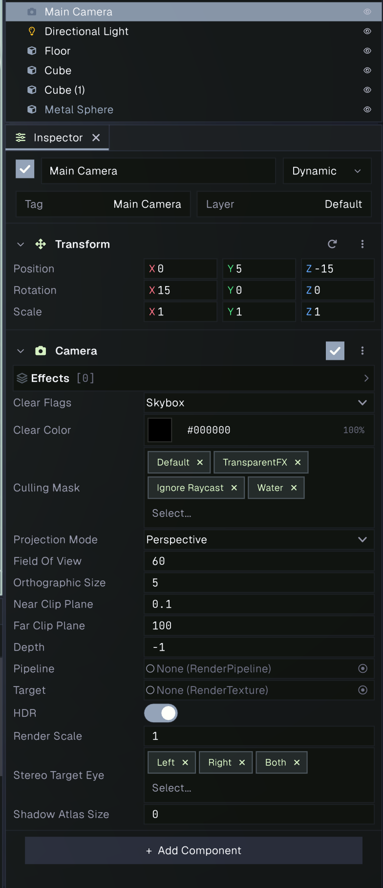

## Camera settings

### Clear and visibility

- **Clear Flags** chooses what happens to the target before the camera draws. **Skybox** clears to the scene skybox, **Solid Color** uses Clear Color, **Depth** preserves existing color but clears depth, and **Nothing** preserves both color and depth. Depth and Nothing are useful when layering cameras.
- **Clear Color** is the background color when Clear Flags is **Solid Color**.
- **Culling Mask** selects which layers this camera renders. Use it to exclude objects or to split a scene across cameras.

### Projection

- **Projection Mode** selects **Perspective** or **Orthographic**. Perspective makes distant objects appear smaller; orthographic keeps their apparent size constant.
- **Field Of View** sets the vertical viewing angle in degrees for perspective projection. A wider angle shows more of the scene and exaggerates perspective.
- **Orthographic Size** is half the vertical span in world units. For example, a size of 5 covers 10 world units vertically; the horizontal span depends on the target aspect ratio.
- **Near Clip Plane** and **Far Clip Plane** set the closest and farthest distances that are rendered. Keep the near plane as far from zero as practical and the far plane as close as practical to improve depth precision.

### Output and ordering

- **Depth** controls camera ordering when multiple cameras draw to the same screen target. Lower depth renders first; higher depth renders later, over the earlier result. Cameras with render texture targets and editor helper cameras do not become the main camera.
- **Target** optionally sends this camera's output to a Render Texture. With no target, it draws to the active screen output, such as the Game View or player window.
- **HDR** enables a high dynamic range render target when supported by the selected pipeline and output. It is useful with effects such as bloom and tonemapping.
- **Render Scale** scales the camera's render resolution. Lower values can improve performance at the cost of image sharpness; higher values increase rendering cost.
- **Pipeline** can specify a render pipeline for this camera. Leave it unset to use the scene or project default pipeline.
- **Shadow Atlas Size** sets this camera's shadow atlas size. A value of 0 uses the pipeline's requested default size.
- **Stereo Target Eye** chooses which headset eyes to render when XR is running. **Both** is the usual setting. Stereo rendering applies to perspective cameras without a Render Texture target.

## Image effects

The **Effects** list applies image effects to this camera. Add an effect from the list, select it to edit its settings, and use its **Enabled** toggle to temporarily bypass it. Effects are evaluated in list order within their render stage; effects can run after opaque geometry, after transparent geometry, or in the post-processing stage. For example, screen-space ambient occlusion and reflections run after opaques, volumetric fog runs after transparents, and effects such as bloom and anti-aliasing run during post-processing. Put a tonemapper before effects that you want to operate on the display-range image.

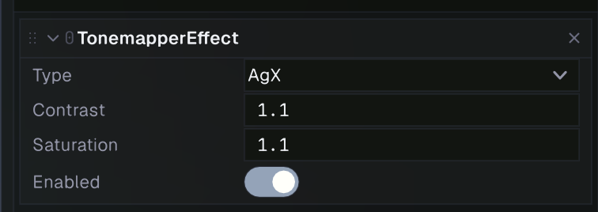

### Anti-aliasing

Anti-aliasing smooths jagged edges. Choose one technique to start; stacking techniques can soften the image and increase render cost.

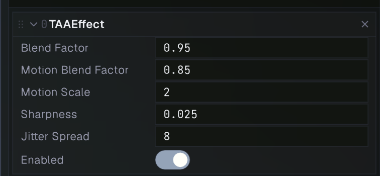

- **TAA (Temporal Anti-Aliasing)** combines samples across frames to reduce edge shimmer and produce a stable image. It uses temporal history, so fast motion can show some ghosting. Its blend and motion controls adjust history strength, motion response, sharpness, and jitter spread.
- **SMAA (Subpixel Morphological Anti-Aliasing)** detects and smooths edge patterns in a post-process pass. Adjust Edge Threshold to change which edges are detected.

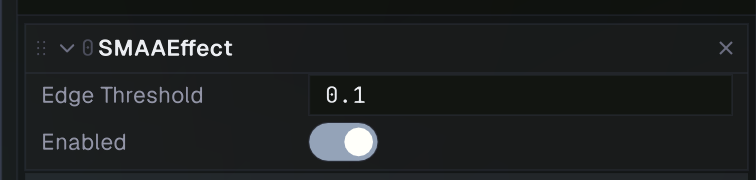

- **FXAA (Fast Approximate Anti-Aliasing)** smooths high-contrast edges with a lightweight image-space pass. Its thresholds control edge detection and Subpixel Quality adjusts smoothing. It is a simple option when temporal history is not desired.

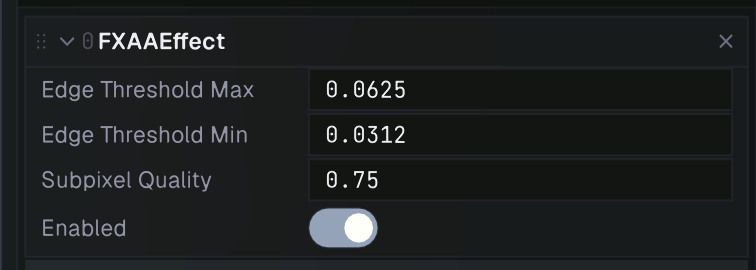

### Lighting and reflections

- **GTAO (Ground Truth Ambient Occlusion)** adds contact shading in creases and where surfaces meet. Slices, direction samples, and resolution affect quality and cost; radius controls the reach, intensity its strength, and temporal options stabilize the result.

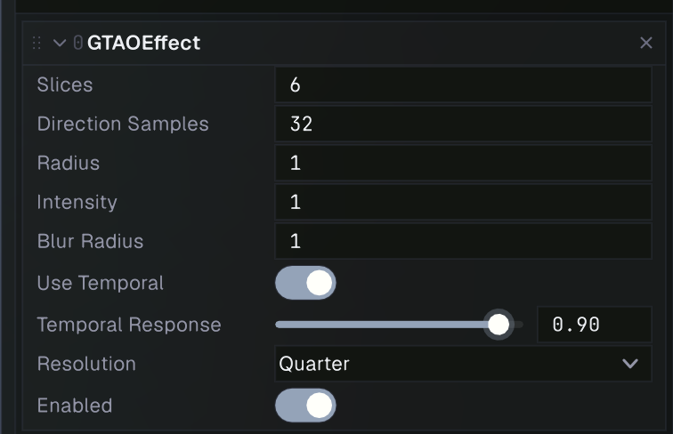

- **Screen Space Reflections** adds reflections using visible scene color and surface data. It works best for surfaces whose reflected objects are on screen; off-screen content cannot appear in the reflection. Ray resolution, distance, and temporal settings trade performance for detail and stability.

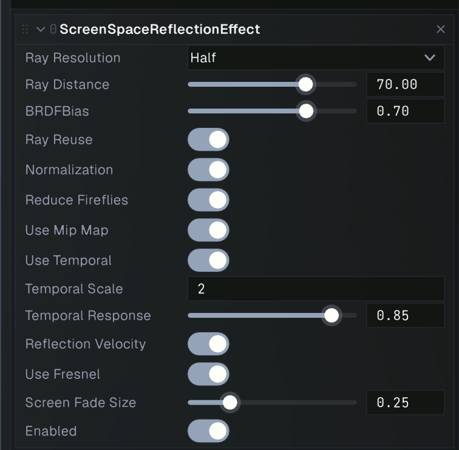

- **Volumetric Fog** ray-marches fog through the scene and scatters light into it. Global Density, color, and scattering shape the fog; light and shadow toggles determine which lights contribute. Steps and downsample scale affect quality and performance. Fog volumes can add local density.

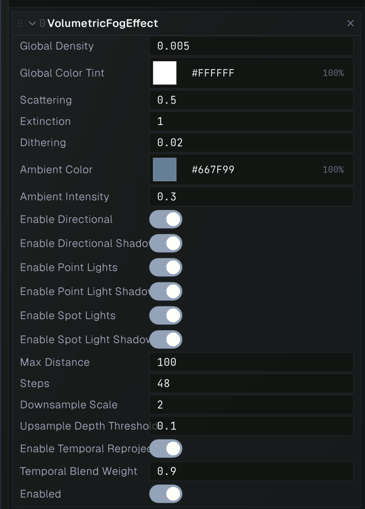

### Exposure, tonemapping, and bloom

- **Auto Exposure** adapts exposure to scene brightness over time. Exposure Compensation shifts the result; Adapt Speed Up and Adapt Speed Down control how quickly exposure responds to brighter and darker scenes, and Min/Max Exposure clamp the range.

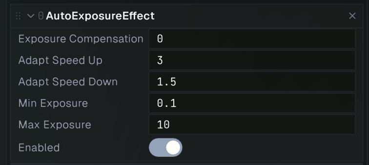

- **Tonemapper** maps HDR brightness into the displayable range. Select a tonemapping operator and adjust Contrast and Saturation. When using HDR, place tonemapping before display-oriented post effects such as FXAA.

- **Bloom** creates a glow around bright areas. Threshold controls which pixels contribute, Intensity controls the glow strength, and Scatter controls how widely it spreads. Iterations increase the blur radius and GPU cost; Anti Flicker can reduce sparkles.

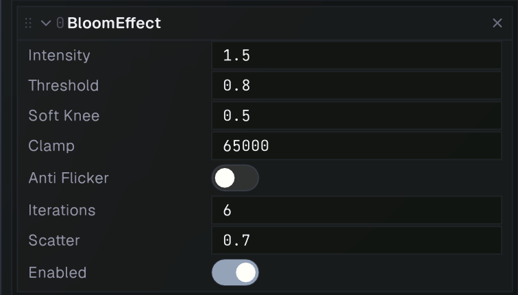

### Depth and motion

- **Bokeh Depth of Field** blurs areas outside the focus distance and creates a lens-like bokeh. Auto Focus tracks scene focus; disable it to set Manual Focus Point. Focus Strength and Max Blur Radius control blur amount, while Resolution and Quality trade detail for speed.

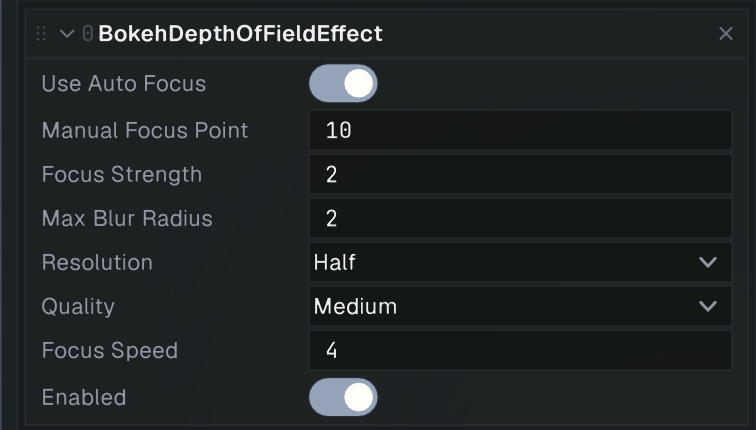

- **Motion Blur** smears moving pixels along their motion direction. Intensity controls the amount; Samples and Max Blur Radius affect quality and the maximum streak length.

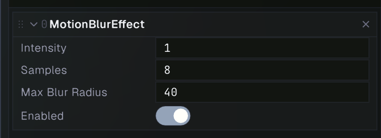

### Cinematic effects

**Cinematic Effects** groups optional image treatments in one effect. Enable each treatment individually and tune its related controls:

- **Vignette** darkens or colors the frame edges.
- **Chromatic Aberration** offsets color channels near edges for a lens-fringe look.
- **Film Grain** adds animated grain; Grain Response controls how it varies with brightness.
- **Color Grading** adjusts exposure, contrast, saturation, temperature, and lift/gamma/gain for shadows, midtones, and highlights.
- **LUT** applies a color lookup texture for a consistent grade.
- **Sharpen** increases local edge contrast.
- **Edge Detection** emphasizes image outlines.
- **Pixelation** reduces the apparent image resolution.
- **God Rays** creates screen-space light shafts from bright pixels.

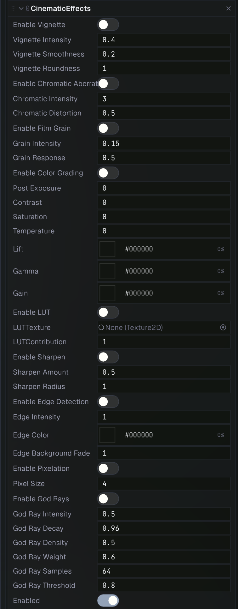

## Multiple cameras

Use multiple cameras when a scene needs layered views, such as a background and an overlay. Set each camera's Clear Flags and Depth deliberately: a later camera that clears to a solid color or skybox replaces the earlier image, while **Depth** preserves its color and draws over it. To find the main screen camera at runtime, use `Camera.Main`; it is the enabled screen camera with the highest Depth in the current scene.
