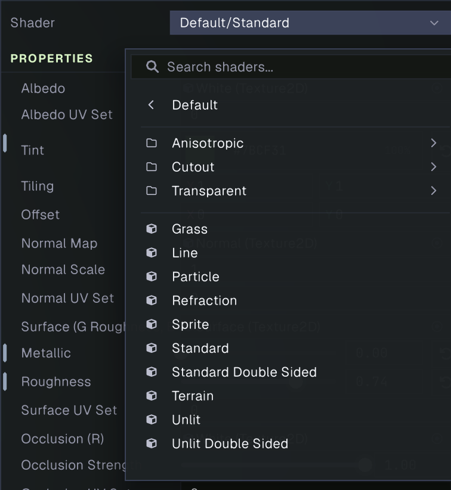
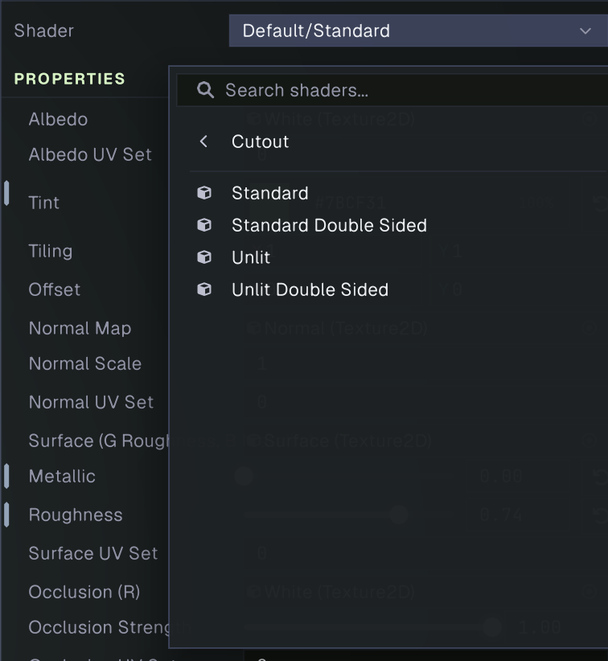
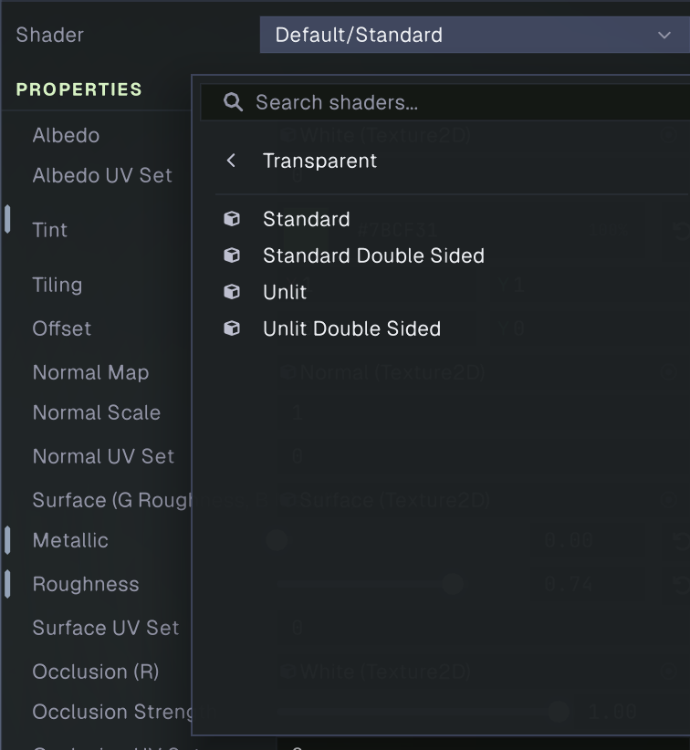
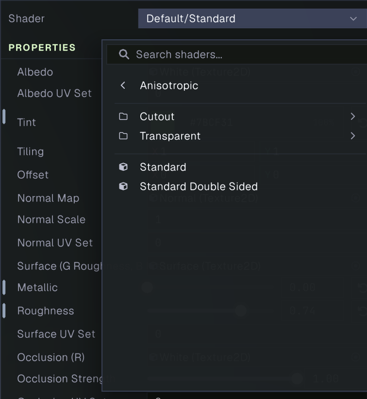
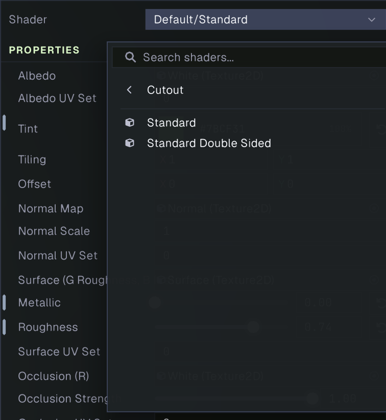
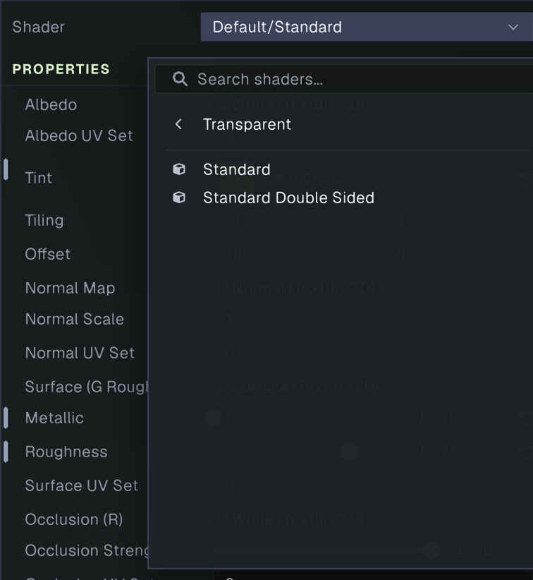
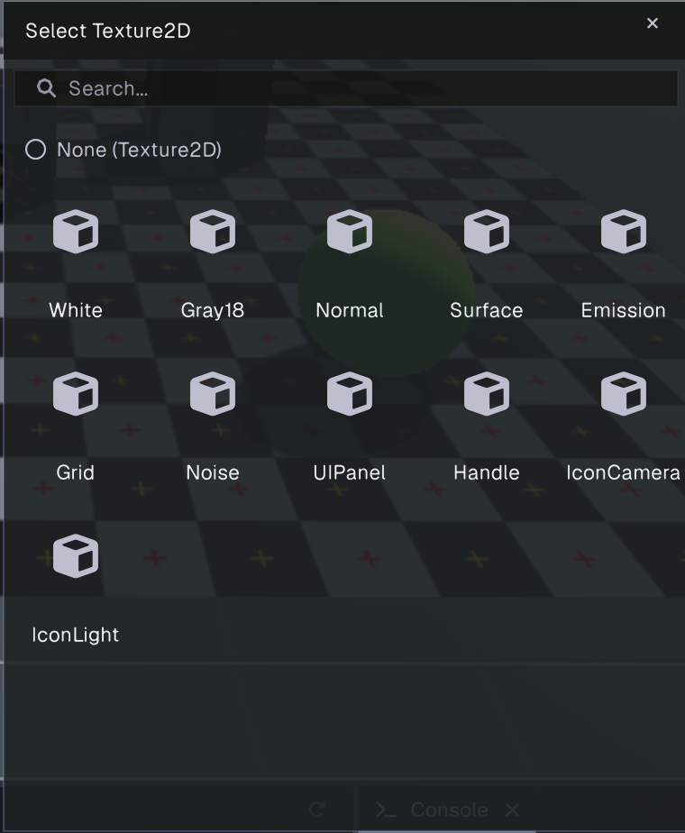

# Materials

A material combines a shader with the values and textures used by that shader. Assign a material to a renderer to control how its mesh looks. Materials are saved as `.mat` assets, so the same material can be reused by multiple objects.

## Create and edit a material

Create a Material asset in the Project panel, then select it to open the Material inspector. You can also create a material while assigning one through a renderer's material field. Select the **Shader** field to choose a built-in or project shader. The available controls below the shader are declared by that shader, so changing the shader changes the material's editable properties.

The inspector includes a live **Preview**. Changes appear on objects using the material as you edit. Changed values are marked with a purple bar; use the revert button on a property row to restore that property's shader default. Save the project or apply the pending material changes to write them to the asset. Use Revert to discard unsaved changes.

## Choose a built-in shader

The built-in shader picker groups shaders by surface type. The Standard family provides lit, physically based materials. It is a good starting point for most solid surfaces. The shader variants determine how the surface handles opacity and back faces:

- **Default / Standard** renders an opaque, single-sided surface.
- **Cutout / Standard** clips pixels below an alpha cutoff. Use it for hard-edged holes such as leaves, fences, and grates. The cutoff is available as a material property.
- **Transparent / Standard** blends partial alpha. Use it for glass-like or translucent surfaces. Transparent surfaces are rendered in a later pass and can have sorting limitations when they overlap.
- **Anisotropic / Standard** adds directional highlights, useful for brushed metal, hair, and other surfaces with elongated reflections. The anisotropy amount and direction map control the effect.
- **Double Sided** variants render both sides of a face. They are useful for thin surfaces such as leaves or cloth, where the mesh has no thickness.

The same cutout, transparent, anisotropic, and double-sided options are available in combinations. Choose the variant that matches the material's opacity and surface response.

## Standard material properties

Standard shader variants expose a common set of material properties. The exact list can vary by shader variant.

- **Albedo** texture and **Tint** define the base surface color. **Tiling** and **Offset** adjust texture coordinates; **Albedo UV Set** selects the mesh UV channel.
- **Normal Map** adds surface detail without extra geometry. **Normal Scale** controls its strength, and **Normal UV Set** selects its UV channel.
- **Surface** packs roughness in the green channel and metallic in the blue channel. **Metallic** and **Roughness** set fallback values or scale the surface response, with corresponding UV Set selection for the texture.
- **Occlusion** uses the red channel to darken creases and sheltered areas. **Occlusion Strength** controls its influence.
- **Emission** texture, **Emissive Color**, and **Emission Intensity** control self-illumination.
- **Height Map** uses its green channel for parallax mapping. **Height Scale** controls apparent depth, while **POM Steps** trades detail for shader cost.
- **Translucency** uses blue for translucency and green for occlusion. Translucency Strength and the scattering controls adjust how light passes through thin surfaces. This is useful for foliage and similar materials.
- **Alpha Cutoff** appears on cutout variants and controls the threshold below which pixels are discarded.
- **Anisotropy** variants add an anisotropy amount and direction map for elongated specular highlights.

Use a texture slot's picker to choose an asset from the project. Click the slot to open the texture selector, then select the desired texture.

## Apply a material to an object

Select a GameObject with a renderer component and assign the material to its material slot. A renderer can use separate materials for separate submeshes. Drag a Material asset from the Project panel onto a compatible object in the scene to assign it.

If several objects share one material asset, edits to that asset affect all of them. To make a variation, duplicate the material asset and edit the duplicate, then assign it to the objects that need the variation.

## Custom shaders

Project shaders can declare material properties in a `Properties` block. Those properties appear in the material inspector according to their declared type: colors, vectors, numeric values, and texture slots are edited with matching controls. A ranged float is shown as a slider. See [Shaders](shaders.md) for authoring shader assets.
