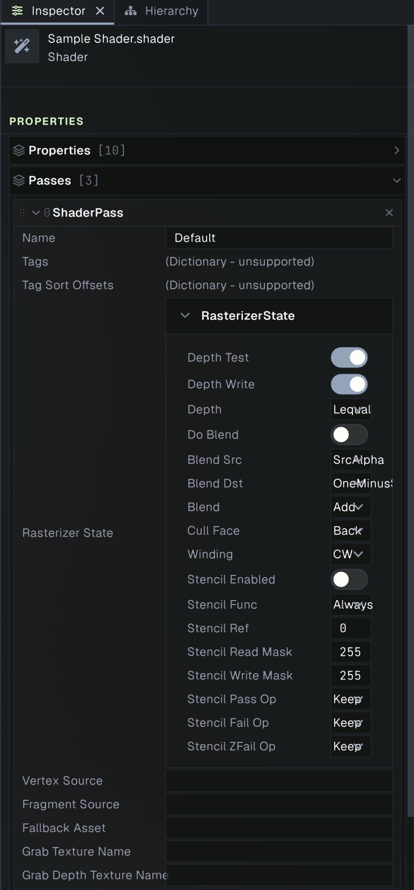
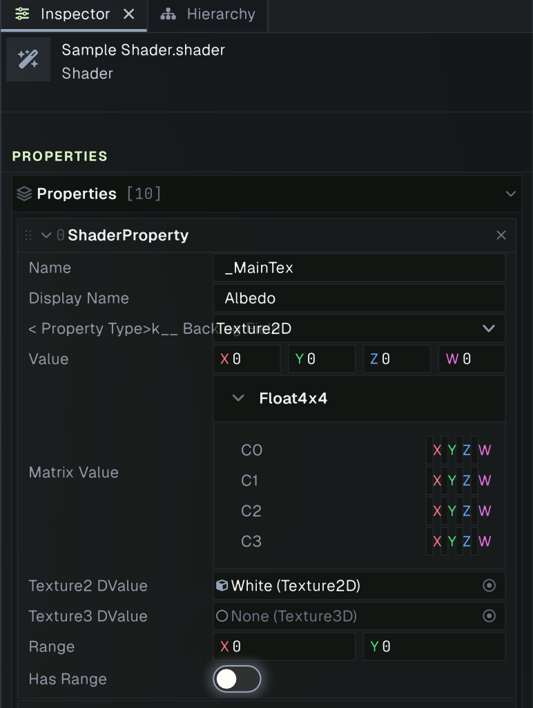
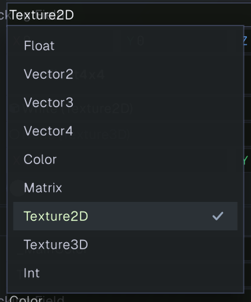

# Shaders

A shader describes how the GPU draws a surface. It contains shader properties that materials can set, and one or more passes that provide the vertex and fragment programs for rendering. Prowl project shaders use the `.shader` file format and GLSL source.

## Create and inspect a shader

Create a Shader asset from the Project panel's create menu. Prowl creates a starter PBR shader with a forward rendering pass, a depth and normals pass, and a shadow caster pass. Edit the `.shader` text in a code editor; when the file changes, Prowl imports it and reports parse or compile errors in the Console. Shader assets can include shared GLSL files with `#include`.



The shader inspector shows the shader's declared properties and passes. Select a property or pass to inspect its settings. Materials that use the shader display its properties in their own inspector, where each material can override the shader defaults. See [Materials](materials.md) for assigning shaders and editing material values.



## Shader file structure

A shader file starts with a quoted shader name, followed by optional `Properties` and one or more `Pass` blocks:

```glsl
// Custom PBR Shader
// GPU instancing, skeletal animation, shadows, and fog are handled
// automatically by the VertexAttributes and Lighting includes.
//
// Vertex utilities (from VertexAttributes.glsl):
//   TransformClip(pos)       - position to clip space (handles instancing + skinning)
//   TransformPosition(pos)   - position to world space
//   TransformDirection(dir)  - normal/tangent to world space
//   GetInstanceColor()       - vertex color with instance tint
//   GetInstanceCustomData()  - per-instance custom vec4
//   GetModelMatrix()         - model matrix (instanced or per-object)
//   GetMVPMatrix()           - MVP matrix
//
// Lighting utilities (from Lighting.glsl):
//   CalculateForwardLighting(worldPos, normal, viewDir, albedo, metallic, roughness, ao)
//   CalculateAmbient(worldNormal)
//   ApplyFog(color, worldPos)

Shader "Custom/NewShader"

Properties
{
    _MainTex ("Albedo", Texture2D) = "white"
    _MainColor ("Tint", Color) = (1.0, 1.0, 1.0, 1.0)
    _NormalTex ("Normal", Texture2D) = "normal"
    _SurfaceTex ("Surface (G Roughness, B Metallic)", Texture2D) = "surface"
    _Metallic ("Metallic", Range(0.0, 1.0)) = 1.0
    _Roughness ("Roughness", Range(0.0, 1.0)) = 1.0
    _OcclusionTex ("Occlusion (R)", Texture2D) = "white"
    _EmissionTex ("Emission", Texture2D) = "emission"
    _EmissiveColor ("Emissive Color", Color) = (1.0, 1.0, 1.0, 1.0)
    _EmissionIntensity ("Emission Intensity", Float) = 1.0
}

// === Main Forward Lit Pass ===
Pass "Default"
{
    Tags { "RenderOrder" = "Opaque" }
    Cull Back

    GLSLPROGRAM

        Vertex
        {
            #include "ProwlCG"
            #include "VertexAttributes"

            out vec2 texCoord0;
            out vec3 worldPos;
            out vec4 vColor;
            out vec3 vNormal;
            out vec3 vTangent;
            out vec3 vBitangent;

            void main()
            {
                gl_Position = TransformClip(vertexPosition);
                texCoord0   = vertexTexCoord0;
                worldPos    = TransformPosition(vertexPosition);
                vColor      = GetInstanceColor();
                vNormal     = TransformDirection(vertexNormal);
#ifdef HAS_TANGENTS
                vTangent    = TransformDirection(vertexTangent.xyz);
                vBitangent  = cross(vNormal, vTangent);
#endif
            }
        }

        Fragment
        {
            #include "ProwlCG"
            #include "Lighting"

            layout (location = 0) out vec4 fragColor;

            in vec2 texCoord0;
            in vec3 worldPos;
            in vec4 vColor;
            in vec3 vNormal;
            in vec3 vTangent;
            in vec3 vBitangent;

            uniform sampler2D _MainTex;
            uniform sampler2D _NormalTex;
            uniform sampler2D _SurfaceTex;
            uniform float _Metallic;
            uniform float _Roughness;
            uniform sampler2D _OcclusionTex;
            uniform sampler2D _EmissionTex;
            uniform vec4 _EmissiveColor;
            uniform float _EmissionIntensity;
            uniform vec4 _MainColor;

            void main()
            {
                // Albedo. Colour textures are sRGB and get decoded here; _MainColor and the vertex
                // colour are linear and multiply in afterwards.
                vec4 albedoTexel = texture(_MainTex, texCoord0);
                vec3 baseColor = gammaToLinearSpace(albedoTexel.rgb) * _MainColor.rgb * vColor.rgb;
                float alpha = albedoTexel.a * _MainColor.a * vColor.a;

                // Normal mapping
                vec3 worldNormal = ApplyNormalMap(_NormalTex, texCoord0, vNormal, vTangent, vBitangent);

                // Surface: G = Roughness, B = Metallic, each scaled by its factor
                vec4 surface = texture(_SurfaceTex, texCoord0);
                float roughness = clamp(surface.g * _Roughness, 0.0, 1.0);
                float metallic = clamp(surface.b * _Metallic, 0.0, 1.0);

                // Ambient occlusion: R channel, 1 = unoccluded
                float ao = texture(_OcclusionTex, texCoord0).r;

                // Emission
                vec3 emission = gammaToLinearSpace(texture(_EmissionTex, texCoord0).rgb) * _EmissiveColor.rgb * _EmissionIntensity;

                // PBR lighting + ambient + fog
                vec3 viewDir = normalize(_WorldSpaceCameraPos.xyz - worldPos);
                vec3 lighting = CalculateForwardLighting(worldPos, worldNormal, viewDir,
                                                         baseColor, metallic, roughness, ao);
                vec3 ambient = CalculateAmbient(worldNormal) * baseColor * ao * _AmbientStrength;
                vec3 color = ApplyFog(ambient + lighting + emission, worldPos);

                fragColor = vec4(color, alpha);
            }
        }
    ENDGLSL
}

// === Depth + Normals Pre-Pass (feeds GTAO, SSR, TAA and motion blur) ===
Pass "Prepass"
{
    Tags { "LightMode" = "Prepass" }
    Cull Back
    ZWrite On

    GLSLPROGRAM

        Vertex
        {
            #include "ProwlCG"
            #include "VertexAttributes"

            out vec3 vNormal;
            out vec3 vTangent;
            out vec3 vBitangent;
            out vec2 texCoord0;
            out vec4 vCurrClipNJ;
            out vec4 vPrevClip;

            void main()
            {
                gl_Position = TransformClip(vertexPosition); // jittered, for raster + depth
                vNormal     = TransformDirection(vertexNormal);
#ifdef HAS_TANGENTS
                vTangent    = TransformDirection(vertexTangent.xyz);
                vBitangent  = cross(vNormal, vTangent);
#endif
                texCoord0   = vertexTexCoord0;

                // Jitter-free current and previous clip positions for motion vectors.
                vec4 worldPos = GetModelMatrix() * vec4(vertexPosition, 1.0);
                vCurrClipNJ = PROWL_MATRIX_VP_NONJITTERED * worldPos;
                vec4 prevWorldPos = PROWL_MATRIX_M_PREVIOUS * vec4(vertexPosition, 1.0);
                vPrevClip = PROWL_MATRIX_VP_PREVIOUS * prevWorldPos;
            }
        }

        Fragment
        {
            #include "ProwlCG"

            layout (location = 0) out vec4 normalOut;
            layout (location = 1) out vec4 motionRM;

            in vec3 vNormal;
            in vec3 vTangent;
            in vec3 vBitangent;
            in vec2 texCoord0;
            in vec4 vCurrClipNJ;
            in vec4 vPrevClip;

            uniform sampler2D _NormalTex;
            uniform sampler2D _SurfaceTex;
            uniform float _Metallic;
            uniform float _Roughness;

            void main()
            {
                vec3 worldNormal = ApplyNormalMap(_NormalTex, texCoord0, vNormal, vTangent, vBitangent);
                normalOut = EncodeViewNormal(worldNormal);

                // Motion vectors plus the roughness/metallic SSR samples. These must match the
                // forward pass or reflections come off the wrong surface.
                vec2 currNDC = (vCurrClipNJ.xy / vCurrClipNJ.w) * 0.5 + 0.5;
                vec2 prevNDC = (vPrevClip.xy / vPrevClip.w) * 0.5 + 0.5;
                vec4 surface = texture(_SurfaceTex, texCoord0);
                motionRM = vec4(currNDC - prevNDC,
                                clamp(surface.g * _Roughness, 0.0, 1.0),
                                clamp(surface.b * _Metallic, 0.0, 1.0));
            }
        }
    ENDGLSL
}

// === Shadow Caster Pass ===
Pass "ShadowCaster"
{
    Tags { "LightMode" = "ShadowCaster" }
    Cull Back

    GLSLPROGRAM

        Vertex
        {
            #include "ProwlCG"
            #include "VertexAttributes"

            void main()
            {
                gl_Position = TransformClip(vertexPosition);
            }
        }

        Fragment
        {
            #include "ProwlCG"

            void main()
            {
                gl_FragDepth = gl_FragCoord.z;
            }
        }
    ENDGLSL
}
```

The shader and pass names identify the assets and passes. A pass can specify render tags, rasterizer state, and separate `Vertex` and `Fragment` GLSL stages. Use the engine's built-in shader includes and starter shader as references for the expected vertex inputs, lighting helpers, and render passes.

## Properties

The optional `Properties` block declares the controls shown in a material inspector. Each declaration has an internal name, a display label, a type, and a default value. The internal name is used by the shader uniform and must match the name used in GLSL. The display label is what users see in the inspector.

Supported types include `Float`, `Int`, `Range(min, max)`, `Vector2`, `Vector3`, `Vector4`, `Color`, `Matrix`, `Texture2D`, and `Texture3D`. A ranged float is edited with a slider. Texture defaults can use built-in defaults such as `"white"`, `"black"`, `"normal"`, `"surface"`, or `"emission"`; texture properties can also be assigned in the material inspector.



For example, this declaration creates a **Tint** color field with a white default:

```glsl
_Tint ("Tint", Color) = (1, 1, 1, 1)
```

The vertex or fragment stage must declare and use the matching uniform. Declaring a property makes it available to materials; it does not automatically change the shader's output.

## Passes and render tags

A pass is a pair of vertex and fragment programs with render state. A shader can have multiple passes for different renderer tasks. Passes commonly use tags such as `RenderOrder` to opt into opaque or transparent drawing, and `LightMode` for specialized work such as depth and normals or shadow casting. The render pipeline selects passes by their tags, so include the passes needed by features your shader should support.

Use `Cull Back` for ordinary one-sided meshes. Double-sided rendering can use `Cull Off`. Blending and depth-writing choices should match the surface: opaque surfaces generally write depth and render in the opaque queue; alpha blended surfaces generally render later and need appropriate blending. See the built-in Standard shaders for working opaque, cutout, transparent, and double-sided examples.

## Includes

Use `#include "File.glsl"` to share functions or declarations. Prowl resolves include paths relative to the shader file first, then the project `Assets` folder, then built-in engine shader includes. Keep project include files alongside the shader or under `Assets` so they can be resolved during import.

## Troubleshooting

- If a shader fails to import, check the Console for parser or GLSL compiler errors and confirm braces, property declarations, and stage blocks are closed correctly.
- If a material control is missing, confirm the property is declared in the shader's `Properties` block and that the shader imported successfully.
- If a material value does not affect rendering, verify that the GLSL stage declares and reads the matching uniform name.
- If an object is absent from a render feature, such as shadows or screen-space effects, make sure the shader has the corresponding pass and tags. The default PBR template demonstrates the forward, depth and normals, and shadow caster passes.
