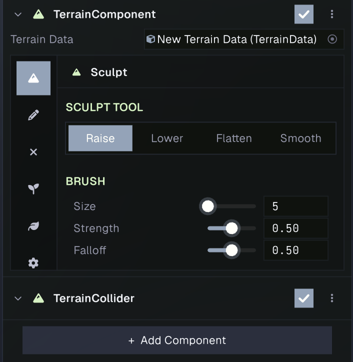
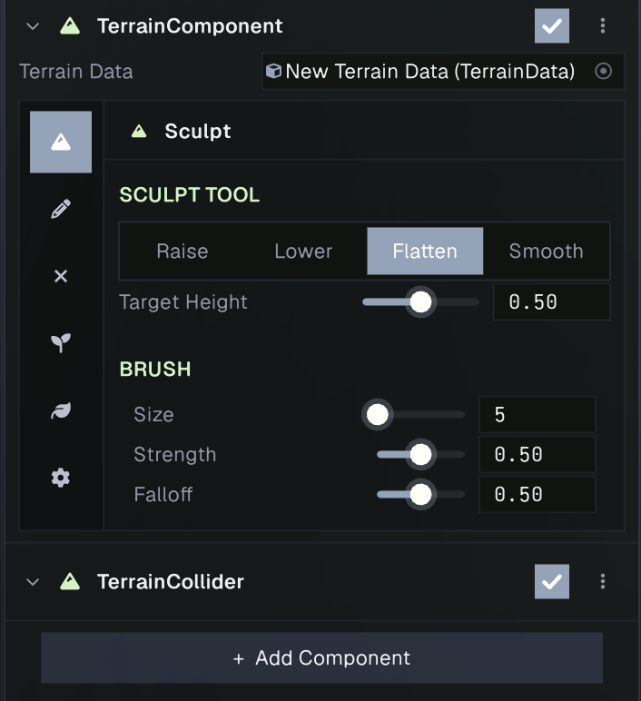
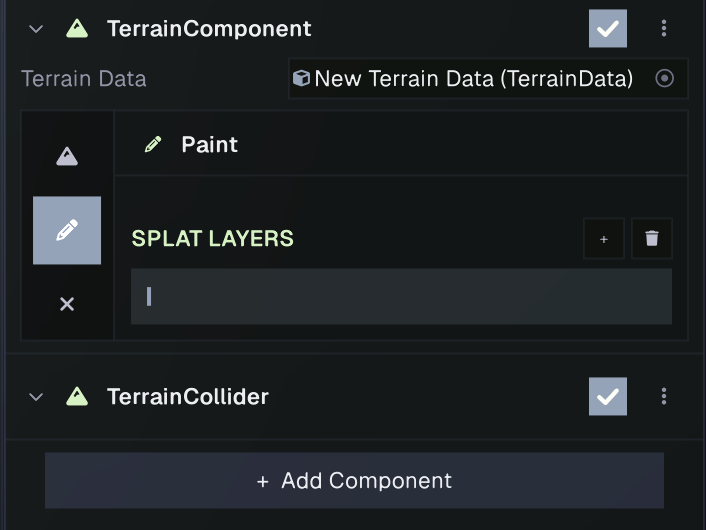
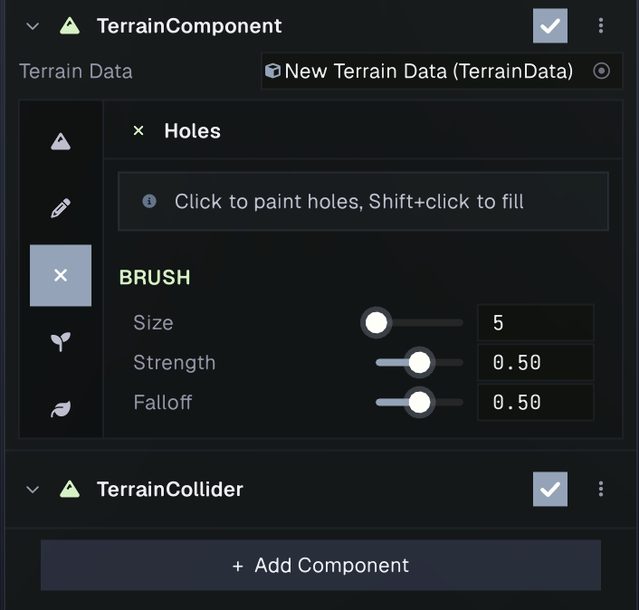
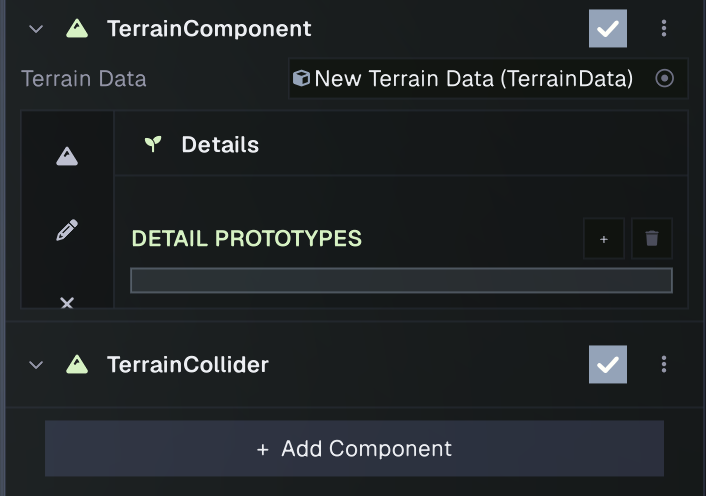
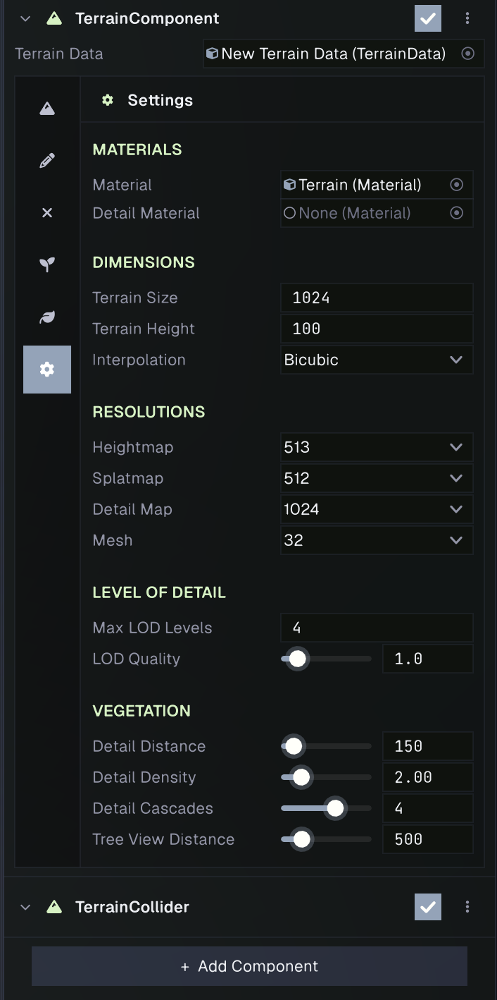
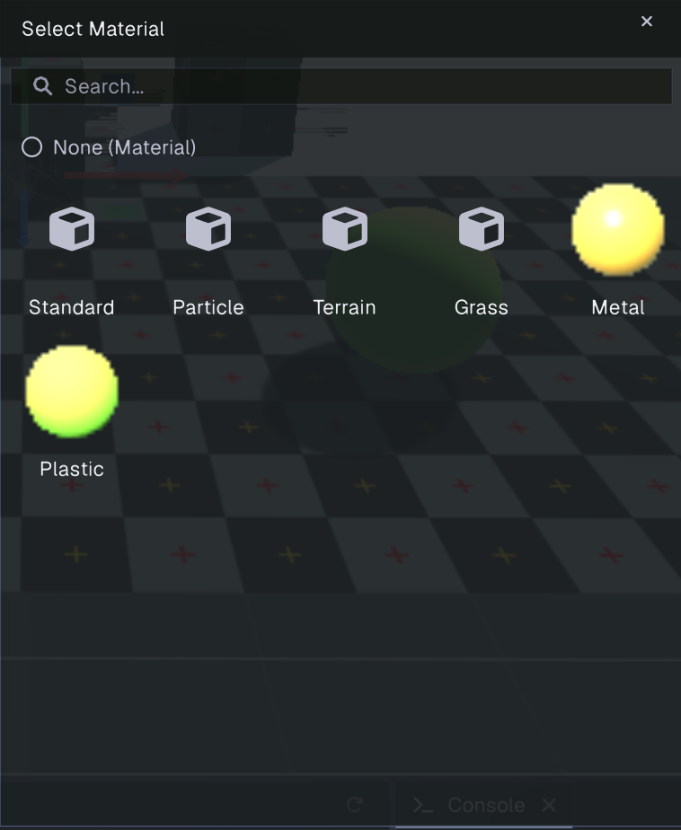

# Terrain

Prowl terrain uses a **Terrain Component** to render a heightmapped landscape and a **Terrain Data** asset to store its shape, painted surface layers, holes, details, and trees. The data asset can also be referenced by a Terrain Collider for physics.

## Set up a terrain

1. Create a **Terrain Data** asset in the Project panel.
2. Add a GameObject and attach **Terrain > Terrain** from the Add Component menu.
3. Assign the Terrain Data asset to the component's **Terrain Data** field.
4. Select the component's Inspector tabs to sculpt, paint, add vegetation, and configure terrain settings.

Terrain edits are made against the assigned data asset. When changes are pending, the Inspector shows an **Unsaved edits** banner with **Save to TerrainData**. Save when you want the changes written to the asset.

## Sculpt the heightmap

Open the **Sculpt** tab and choose a height tool:

- **Raise** and **Lower** add or remove height under the brush.
- **Flatten** moves terrain toward the selected **Target Height**.
- **Smooth** reduces sharp changes in height.

The brush **Size** sets its radius, **Strength** controls how quickly it changes the terrain, and **Falloff** controls how gradually the effect fades at the brush edge. Drag across the terrain in the Scene View to sculpt; the brush preview shows its area.

## Paint surface layers

The **Paint** tab manages splat layers. Select a layer, then drag over the terrain in the Scene View to paint it. Use **+** and the delete button to add or remove layers. A terrain supports up to eight layers.

Configure the selected layer with:

- **Albedo** and **Normal Map** textures.
- **Tiling**, which scales the layer textures across the terrain.
- **Roughness** and **Metallic**, which define the surface response.

The Paint brush's Size, Strength, and Falloff control the painted area and blending. The terrain shader blends painted layer weights so areas can transition between surfaces.

## Cut holes

Open the **Holes** tab and drag over the terrain to remove terrain surface and collision in the painted area. **Shift-click** to fill holes back in. The brush settings control the size and softness of the edited region.

## Add details

The **Details** tab places small vegetation such as grass or ground plants. Add a detail prototype, select it, choose its **Render Mode**, and assign the required asset:

- **Texture Billboard** uses a texture on a quad facing the camera.
- **Texture NonBillboard** uses a texture on a fixed-orientation quad.
- **Mesh** instances a 3D mesh and supports materials per mesh submesh.

Prototype settings include minimum and maximum width and height, **Noise Spread**, **Bend Factor**, **Align To Normal**, and healthy and dry colors. Texture modes can use a prototype-specific Grass Material; otherwise the terrain's detail material is used. Paint the selected prototype over the terrain with the brush.

Terrain-wide vegetation controls are in **Settings**. **Detail Distance** limits how far details are drawn. **Detail Density** sets cells per metre: increasing it can raise the number of instances substantially. **Detail Cascades** divides the view distance into quality bands, reducing density farther from the camera.

## Place trees

The **Trees** tab manages tree prototypes. Add a prototype, assign a mesh and its materials, and adjust its **Bend Factor** for wind response. Select the prototype, then click terrain to place trees. **Shift-click** removes trees in the brush area. **Brush Size** controls the placement radius and **Trees Per Stroke** controls the number placed per click.

**Tree View Distance** in Settings controls how far tree instances are rendered.

## Terrain settings

The **Settings** tab configures materials, dimensions, resolutions, level of detail, and vegetation.

### Materials

- **Material** sets the terrain surface material.
- **Detail Material** overrides the default grass material used for texture-based detail prototypes.

### Dimensions and interpolation

- **Terrain Size** sets the terrain's horizontal size in world units.
- **Terrain Height** sets the vertical range represented by the normalized heightmap.
- **Interpolation** chooses **Bilinear** or **Bicubic** height sampling. Bicubic produces smoother interpolation between samples.

### Resolutions

- **Heightmap** controls height samples per side. Changing it resets the height data, and the editor asks for confirmation.
- **Splatmap** controls the resolution of painted surface weights. Changing it resets the painted splat data.
- **Detail Map** controls the density map resolution for details. Changing it resamples existing detail paint.
- **Mesh** controls the base terrain mesh grid resolution used for rendering.

Higher map resolutions retain more detail and use more memory. Choose resolutions before extensive sculpting and painting where possible.

### Level of detail

Terrain rendering uses quadtree level of detail to subdivide the landscape near the camera. **Max LOD Levels** sets the maximum subdivision depth. **LOD Quality** adjusts how readily the terrain adds detail at distance: higher values preserve more detail and cost more to render.

## Terrain and physics

Add a **Terrain Collider** to the same GameObject when the terrain needs to participate in physics. It reads the assigned Terrain Data heightmap, and holes are omitted from terrain collision.
