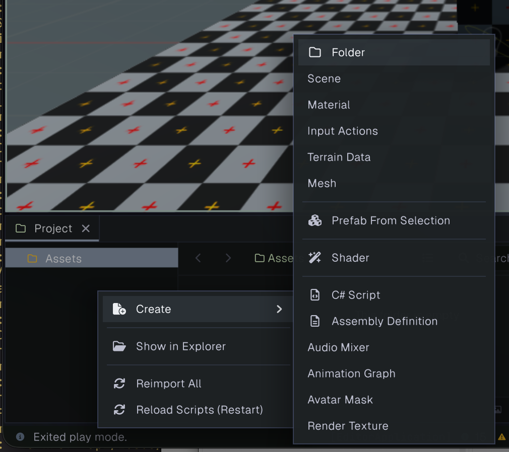
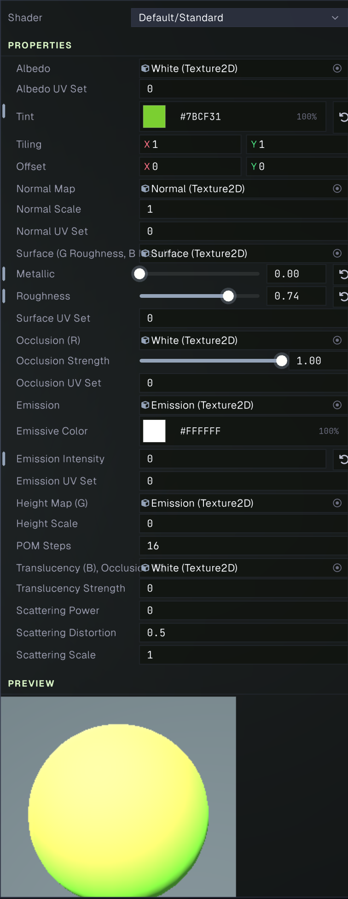

# Paint: Create and Apply a Material

In this beginner tutorial, you’ll create a material, change its color, and apply it to an object in your scene. You’ll also see how a material uses a shader to determine which settings are available.

## What you’ll need

Open a project in Prowl and have a scene with a camera, a light, and a mesh object such as a cube. If you need to create a mesh, use **GameObject > 3D Object > Cube**. A light helps show the shading on the Standard material.

## 1. Create a material asset

1. In the **Project** panel, open the folder where you want to keep the material.
2. Right-click an empty area and choose **Create > Material**.
3. Name the new asset `Paint` and confirm the name.
4. Select `Paint` to open it in the Inspector.

## 2. Choose a shader

In the material Inspector, open the **Shader** picker and choose **Default > Standard**. The Standard shader exposes a **Tint** color along with surface controls and texture slots. The material preview updates as you edit it.

## 3. Paint it with color

Find **Tint** in the material's Properties. Click the color field to open its color picker, then choose a color. For this tutorial, try a vivid color such as orange, blue, or green. Close the picker when you’re happy with the result.

The **Albedo** texture is white by default, so the Tint sets the visible base color. If you later assign an Albedo texture, Tint multiplies with that texture.

Click the **Apply** button at the bottom of the material properties to save the changes to the Material.

## 4. Apply the material to an object

1. Select your mesh object in the **Hierarchy**.
2. In its Inspector, find the **Mesh Renderer** component and its material slot.
3. Drag `Paint` from the Project panel onto the material slot, or use the slot’s asset picker to select it.
4. Look at the Scene or Game view. The object should now use the color you chose.

If your object stays white, check that the Mesh Renderer has `Paint` assigned and that the selected shader is **Default > Standard**. Also make sure the object is visible to the camera and illuminated by a light.

## 5. Save and reuse it

Save the project to preserve your material asset. Any object that uses `Paint` shares its settings, so changing the Tint updates every object that uses that material. To make a second color, duplicate the material asset and edit the duplicate, then assign it to another object.

## What you learned

You created a Material asset, selected a shader, changed a color property, and assigned the material to a renderer. The shader defines the material controls; the material stores the values and assets that customize how an object looks. Continue with the [Shaders tutorial](shader-tutorial.md) to learn how those controls are defined.
