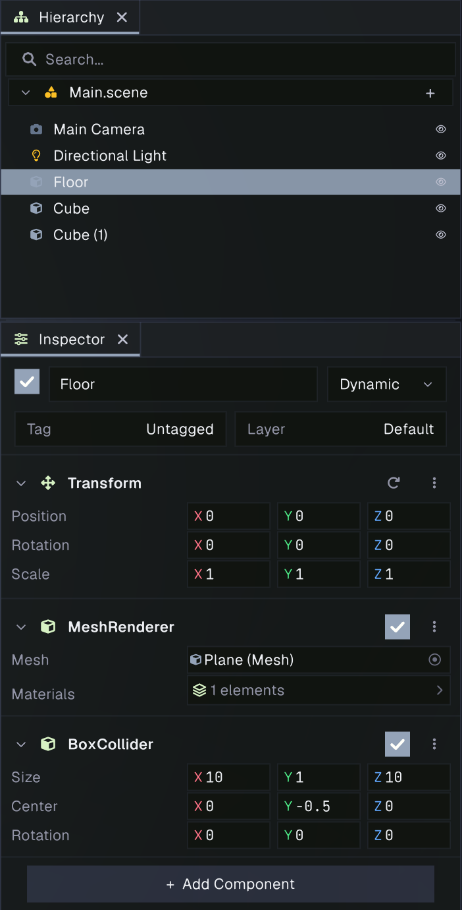
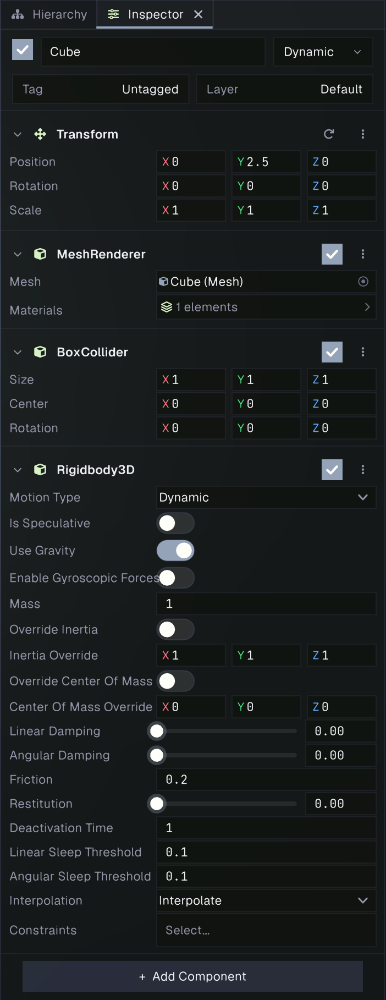
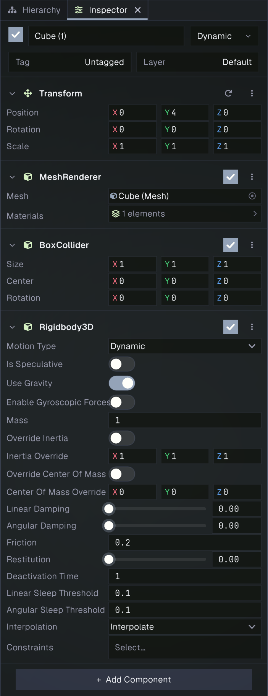

# Physics Basics: Drop Cubes onto the Floor

In this beginner tutorial, you’ll add simple 3D physics to the default scene. You’ll give the Floor a collider and give each cube a collider and a Rigidbody. When you enter Play mode, gravity will pull the cubes down until they land on the Floor.

## What you’ll need

Create or open a project, then open a new default scene. It contains a **Floor**, **Cube**, and **Cube (1)**, along with a camera and light. The default scene objects have renderers, but they do not have physics colliders or rigid bodies yet.

## 1. Add a collider to the Floor

1. Select **Floor** in the Hierarchy.
2. In the Inspector, click **Add Component**.
3. Search for **Box Collider** and add it.
4. Size the box collider in X and Z to match the floor, so Size: X=10, Y=1, Z=10.
5. Move the box collider so the center is lowered and the top of the box matches the floor. This is at Center: x=0, Y=-0.5, Z=0.

The Floor is a flat plane at the world origin. Its Box Collider uses the GameObject’s transform and gives the cubes a surface to land on. Leave the Floor without a Rigidbody; a collider without a Rigidbody acts as static geometry.

## 2. Make the first cube physical

1. Select **Cube** in the Hierarchy.
2. Click **Add Component**, search for **Box Collider**, and add it.
3. Click **Add Component** again, search for **Rigidbody**, and add it.
4. Leave the Rigidbody’s **Motion Type** set to **Dynamic** and **Affected By Gravity** enabled.
5. Set this Cube's position to Position: X=0, Y=2.5, Z=0. *Make sure you are setting the Position of the cube itself and not the collider attached to this cube.*

The default cube is positioned at Y = 0.5, so it begins just above the Floor. Its Box Collider detects contact with the Floor, and its dynamic Rigidbody lets gravity move it.

## 3. Set up the second cube

Repeat the same steps for **Cube (1)**: add a **Box Collider** and a **Rigidbody**, leaving it Dynamic with gravity enabled. Set it's position to Position: X=0, Y=4, Z=0. It starts above the first Cube and will fall onto the first Cube.

## 4. Run the scene

1. Save the scene.
2. Enter **Play** mode.
3. Watch both cubes fall and settle on the Floor. Stop Play mode to return to the saved scene state.

If a cube falls through the Floor, check that the Floor has a Box Collider and that both cubes have Box Colliders and enabled Dynamic Rigidbodies. If a cube does not move, confirm its Rigidbody is enabled, its Motion Type is Dynamic, and **Affected By Gravity** is checked. The project’s default gravity is `(0, -9.81, 0)`.

## What you learned

A collider gives an object a shape for collision detection. A Rigidbody makes an object participate in the simulation; a Dynamic body responds to gravity and collisions. Static geometry, such as this Floor, only needs a collider. For the gravity setting and other project-wide physics options, see [Project Settings](../editor/projectsettings.md).
