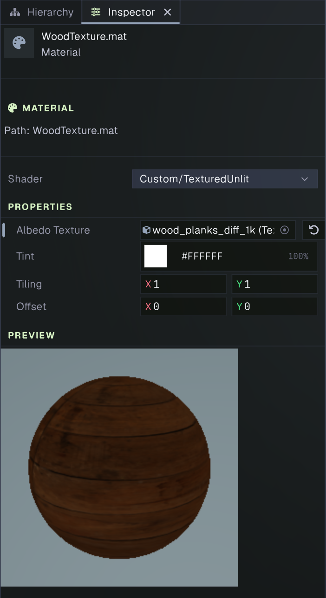

# Shader Textures: Add UVs and Sample an Image

In [Shader Basics](shader-basics-tutorial.md), you wrote a shader that outputs one color across a mesh. This tutorial adds a 2D texture: the vertex shader passes the mesh’s UV coordinates to the fragment shader, which samples the image at each pixel. The result is an unlit textured shader that makes the UV mapping easy to see.

## What you’ll need

You’ll need a Prowl project with a mesh object and a camera. A cube is a useful test mesh because its faces have UVs. The sample image is the **Wood Planks** diffuse texture from Poly Haven. Poly Haven marks the asset CC0, so you can use it in personal or commercial projects. Download the diffuse map from the [Wood Planks asset page](https://polyhaven.com/a/wood_planks) and save the PNG in your project’s `Assets` folder. The page offers several image sizes; choose a modest size such as 1K for this exercise.

## 1. Create a shader asset

1. In the **Project** panel, open your project’s `Assets` folder.
2. Right-click an empty area and choose **Create > Shader**.
3. Name the shader `TexturedUnlit.shader`. The *.shader* extension should be added automatically. Extensions do not show on assets by default but they can be toggled to be displayed from the View settings menu.
4. Open it in your code editor, replace its contents with the shader below, and save. Prowl imports shader files when they change; check the Console for import or compilation errors.

## 2. Pass UVs and sample the texture

Paste this shader into `TexturedUnlit.shader`:

```glsl
Shader "Custom/TexturedUnlit"

Properties
{
    _MainTex ("Albedo Texture", Texture2D) = "white"
    _Tint ("Tint", Color) = (1.0, 1.0, 1.0, 1.0)
    _Tiling ("Tiling", Vector2) = (1.0, 1.0)
    _Offset ("Offset", Vector2) = (0.0, 0.0)
}

Pass "Forward"
{
    Tags { "RenderOrder" = "Opaque" }
    Cull Back

    GLSLPROGRAM
        Vertex
        {
            #include "ProwlCG"
            #include "VertexAttributes"

            out vec2 texCoord;

            void main()
            {
                gl_Position = TransformClip(vertexPosition);
                texCoord = vertexTexCoord0;
            }
        }

        Fragment
        {
            #include "ProwlCG"

            layout (location = 0) out vec4 fragColor;

            in vec2 texCoord;

            uniform sampler2D _MainTex;
            uniform vec4 _Tint;
            uniform vec2 _Tiling;
            uniform vec2 _Offset;

            void main()
            {
                vec4 texel = texture(_MainTex, texCoord * _Tiling + _Offset);
                vec3 imageColor = gammaToLinearSpace(texel.rgb);
                fragColor = vec4(imageColor * _Tint.rgb, texel.a * _Tint.a);
            }
        }
    ENDGLSL
}
```

In the **Vertex** stage, `vertexTexCoord0` is the mesh’s first UV channel. The shader passes it to the fragment stage as `texCoord`. UVs are 2D coordinates attached to mesh vertices; interpolated across each triangle, they tell the fragment shader which part of the image to read.

In the **Fragment** stage, `sampler2D _MainTex` declares the texture input, and `texture(_MainTex, uv)` samples it. `_Tiling` scales the UVs and `_Offset` shifts them before sampling. `gammaToLinearSpace` converts the sampled color image from sRGB to linear color space; the Tint multiplies the sampled color. The default white texture and white tint leave the image unchanged until you assign your own texture or tint.

## 3. Create and configure a material

1. In the Project panel, create a **Material** asset and name it `WoodTexture`.
2. Select it and use the **Shader** picker to choose **Custom > TexturedUnlit**.
3. In the material properties, assign the downloaded diffuse PNG to **Albedo Texture**.
4. Leave **Tint** white and **Tiling** at `(1, 1)` for the first look. If the pattern is too large or small, increase or decrease both tiling values.

Prowl imports common image formats, including PNG, as texture assets. The texture property in the material can reference the imported asset.



## 4. Apply the material and inspect the result

1. Select a mesh in the Hierarchy. (If you do not ahve one you can create a 3D object from the Hierarchy right-lick menu.)
2. In its **Mesh Renderer** component, assign `WoodTexture` to the material slot.
3. View the mesh in the Scene or Game view. Because this shader outputs the sampled image directly, scene lights do not change its brightness.

If the mesh stays white, confirm the texture is assigned to **Albedo Texture**, the material uses **Custom > TexturedUnlit**, and the Console has no shader errors. If the texture appears as one color or is missing on the mesh, check that the mesh has UV coordinates. A cube created in Prowl has UVs; a custom mesh needs UV0 data. If the texture looks stretched or misplaced, adjust the mesh UVs or the shader’s tiling and offset.

## Try another UV channel

Prowl exposes a second set of mesh coordinates as `vertexTexCoord1` when the mesh has UV1. To sample that set, change the vertex shader’s assignment from `texCoord = vertexTexCoord0;` to `texCoord = vertexTexCoord1;`. UV1 is often reserved for lightmaps, so keep UV0 for ordinary surface textures unless your mesh is authored for a different layout.

## Next steps

This example is deliberately unlit and only demonstrates UVs and a color texture. For a lit textured material, see [Shader Advanced](shader-advanced-tutorial.md) and the [Standard shader](../graphics/materials.md), which combine albedo sampling with PBR lighting, normal maps, roughness, metallic, and shadow support.
