# Terrain: Sculpt a Landscape and Add Vegetation

In this tutorial, you’ll build a small outdoor scene from a Terrain Data asset. You’ll shape the heightmap, paint two surface layers, add grass as terrain details, place trees, and save the edited terrain. The instructions use free assets from Kenney and Poly Haven; each linked asset page identifies its license.

## What you’ll need

Create or open a Prowl project. This tutorial uses the default scene’s camera and light, and a terrain measuring 128 by 128 world units.

Download these assets before you start:

- From Kenney’s [Nature Kit](https://kenney.nl/assets/nature-kit), select **Download** and continue (donating is your choice). Extract the archive. We’ll use `Models/GLTF format/tree_oak.glb` as the tree source. The pack is Creative Commons CC0.
- From Kenney’s [Foliage Sprites](https://kenney.nl/assets/foliage-sprites), select **Download** and continue (donating is your choice). Extract the archive and use `PNG/Flat/Sprite_0001.png` as the terrain detail texture. Choose the **Flat** version rather than the corresponding image in `PNG/Shaded`: the terrain’s default grass material supplies lighting and color variation, so a sprite without baked-in shading gives the cleanest result. The pack is Creative Commons CC0.
- From Poly Haven, download [Leafy Grass](https://polyhaven.com/a/leafy_grass) and [Rock Ground](https://polyhaven.com/a/rock_ground). On each page choose **1K**, then the **Diffuse** map, then **PNG**. Use those two PNGs as the terrain’s grass and rocky surface albedos. These assets are CC0. Leave the other PBR maps for a later project; this exercise only needs the diffuse color maps.

In the Project panel, create a `TerrainTutorial` folder under `Assets`, then create `Models`, `Textures`, and `Foliage` folders inside it. Copy `tree_oak.glb` into `Models`, the two Poly Haven diffuse PNGs into `Textures`, and `Sprite_0001.png` into `Foliage`. Prowl imports the files when they appear in the project.

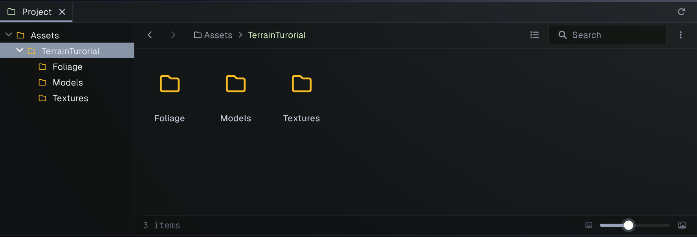

> **Asset note:** The Kenney models and foliage sprites use a simple stylized look. Keeping the tree style consistent with the sprite makes the result easier to read while you learn the terrain tools.

## 1. Create and configure the terrain

1. In the Project panel, open `Assets/TerrainTutorial`.
2. In the **Hierarchy**, choose **GameObject > 3D Object > Terrain**. Prowl creates a Terrain GameObject with a Terrain component, Terrain Collider, and a new Terrain Data asset.
3. In the Project panel, find the new **New Terrain Data** asset (it is created in the project’s Assets folder) and move it into `Assets/TerrainTutorial`. Rename it `MeadowTerrain`.
4. Select the terrain GameObject and confirm its **Terrain Data** field still points to `MeadowTerrain`. If moving or renaming it cleared the reference, assign the renamed asset again.
5. Open the Terrain **Settings** tab. Set **Terrain Size** to `128` and **Terrain Height** to `32`. Leave the map resolutions at their defaults for this exercise.

The default scene may also contain a **Floor**, **Cube**, and **Cube (1)**. They do not interfere with the terrain. If you want a cleaner outdoor scene, you can delete those three objects from the Hierarchy and keep the camera and light.

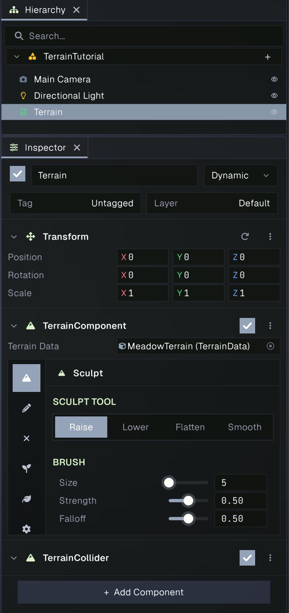

The **Terrain Data** asset stores the heightmap, painted surface weights, detail paint, and tree placements. The Terrain component displays that data in the scene. When you make edits, use **Save to TerrainData** in the **Unsaved edits** banner to save them to the asset.

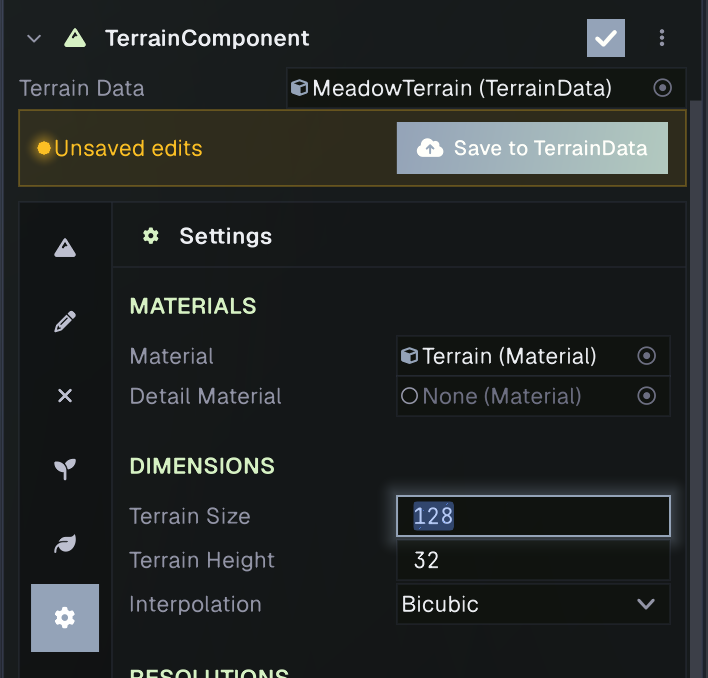

## 2. Sculpt hills and a path

1. Select the terrain and open the **Sculpt** tab in its Inspector.
2. Choose **Raise**. Set **Size** to about `28`, **Strength** to about `0.25`, and **Falloff** to about `0.7`.
   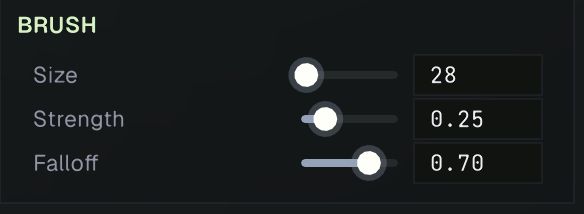
3. In the Scene View tool strip, make sure the Terrain brush tool is active (not the transform tool). The brush preview should appear when the pointer is over the terrain.
   
4. Using **Raise**, drag a few short strokes in separate areas to make low hills. Use short strokes at first; you can always add more height.
5. Switch to **Lower** and make a shallow dip between the hills for a path or stream bed. Keep the strokes narrow so the surrounding slopes remain.
6. Choose **Smooth** and make one or two passes over abrupt edges. Smooth blends the shape; it does not flatten the terrain.
7. To make a level clearing, choose **Flatten**, set **Target Height** to a value near the existing ground (start around `0.15`), then brush a small area. The target is normalized within the terrain’s height range, so adjust it gradually while watching the Scene View.
   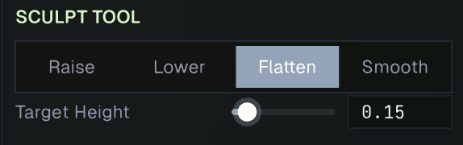
8. Save with **Save to TerrainData** when the shape looks right.

If you sculpt too much, use the editor’s Undo command immediately after the stroke, or use **Lower** and **Smooth** to reshape it. The brush preview shows the affected area before and during a stroke.

## 3. Set up two paint layers

New Terrain Data starts with four empty splat layers. We’ll use the first two for grass and rocky surfaces; leave the other two empty.

1. Open the **Paint** tab. It shows the four layers and controls for the selected layer.
2. Select **Layer 0**. In its settings, assign the imported **Leafy Grass** PNG to **Albedo**. Leave **Normal Map** empty, set **Tiling** to about `8`, **Roughness** to `1`, and **Metallic** to `0`.
   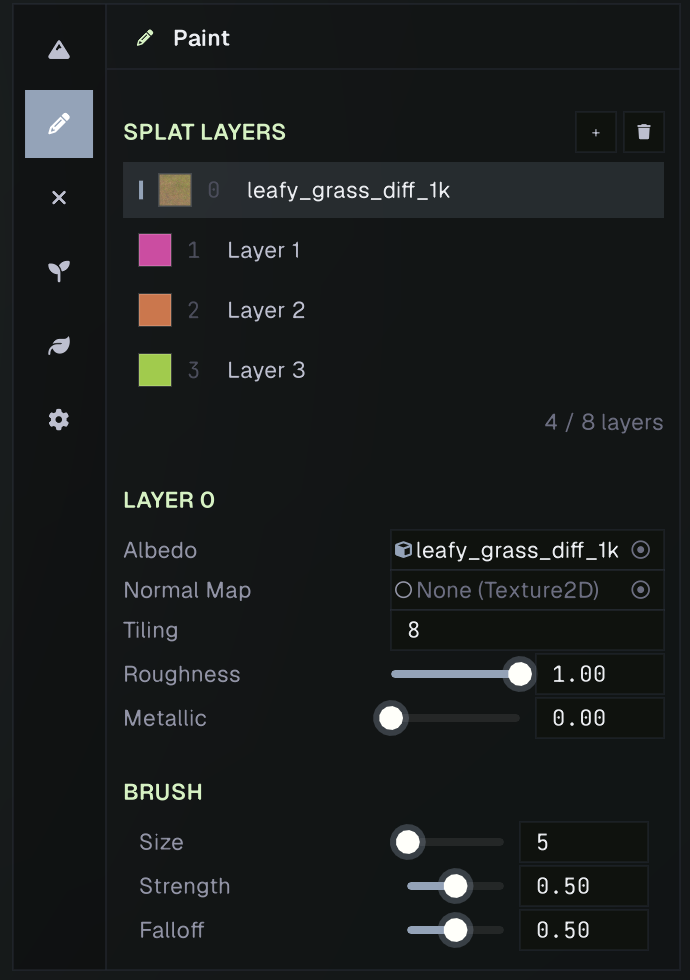
3. Select **Layer 1** and assign the **Rock Ground** PNG to **Albedo**. Use the same starting values. The textures repeat across the terrain; change **Tiling** if their pattern looks too large or too small.
   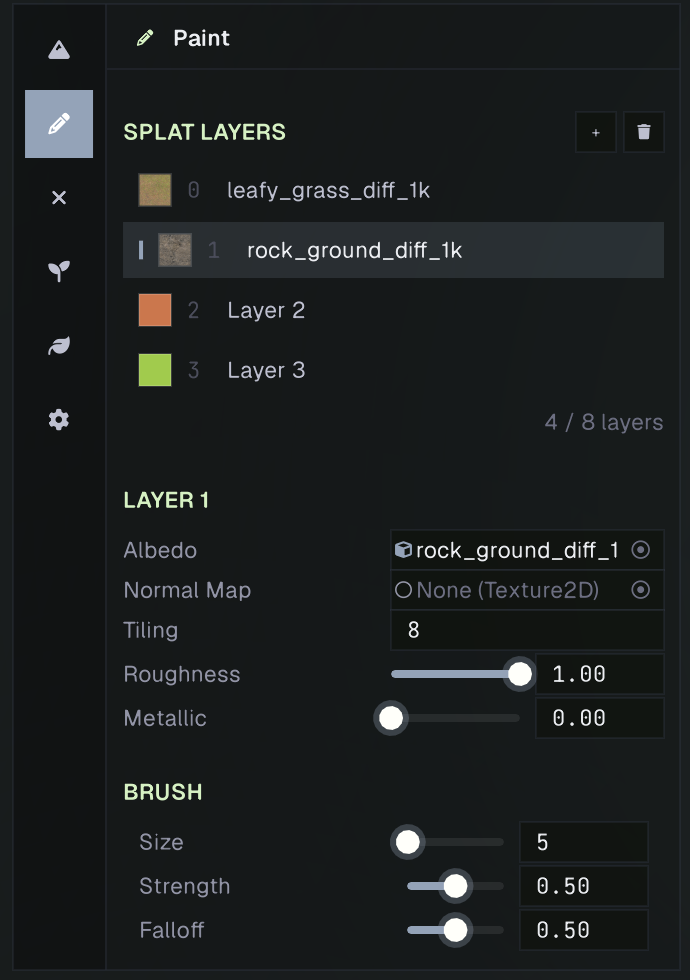
4. Select **Layer 0** again. In the Scene View, drag over the low areas and clearing to paint grass. The Paint brush’s **Size**, **Strength**, and **Falloff** control the painted footprint and blending.
5. Select **Layer 1** and paint some of the steeper hillsides and the path. Use a lower **Strength** or a few short strokes so the change blends with the grass.
6. Save with **Save to TerrainData**.

The layer number in the paint list determines its index; after assigning a texture, the thumbnail/name may show the texture’s asset name. If you see a flat color instead of the expected texture, check that the correct imported PNG is assigned to **Albedo** for the selected layer.

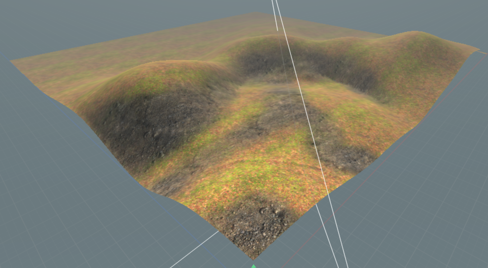

## 4. Paint grass and low plants

Terrain details are small repeated objects painted into a density map. We’ll use a single transparent foliage image as a camera-facing billboard.

1. Open the **Details** tab and select the first empty detail prototype tile. A new Terrain Data asset includes one empty detail prototype; if the list is empty, select **+** to add one.
2. Set **Render Mode** to **Texture Billboard**.
3. Assign `Sprite_0001.png` from the `Flat` folder to **Texture**. This image supplies the plant shape and transparency; it is tinted by the prototype’s **Healthy Color** and **Dry Color**. Leave **Grass Material** empty to use the terrain’s detail material. Set **Healthy Color** to a natural medium green such as `#5F8F3AFF` and **Dry Color** to a muted straw green such as `#A6A05A` for a varied, leafy look.
   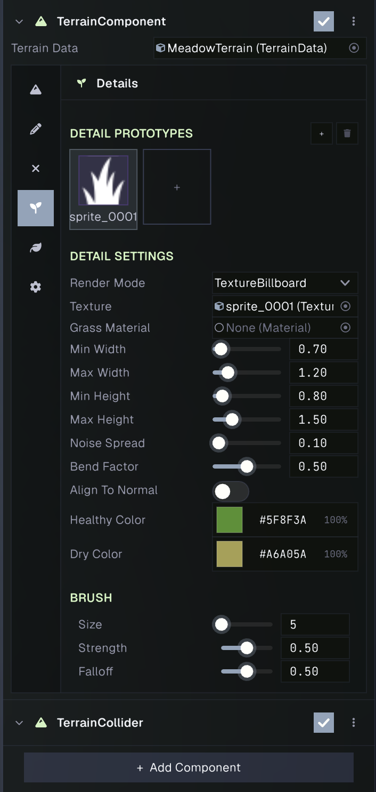
4. Set **Min Width** to `0.7`, **Max Width** to `1.2`, **Min Height** to `0.8`, and **Max Height** to `1.5`. Leave **Noise Spread** near its default. Keep **Align To Normal** enabled so the plants follow slopes.
5. In the Scene View, drag short strokes over the grass-painted clearing and the lower slopes. Avoid painting the path and steep rocky areas. Add a little at a time; high density can create many instances.
6. If the plants are too large, lower both width and height values. If they are too sparse or dense, adjust the prototype paint with **Undo** where possible, or change **Detail Density** in **Settings** before painting more.
7. Save with **Save to TerrainData**.

If the texture looks like a rectangle, confirm that you assigned the individual transparent `Sprite_0001.png` from `Flat`, not a preview image or sprite sheet. If the details are not visible at a distance, open **Settings** and increase **Detail Distance** modestly.

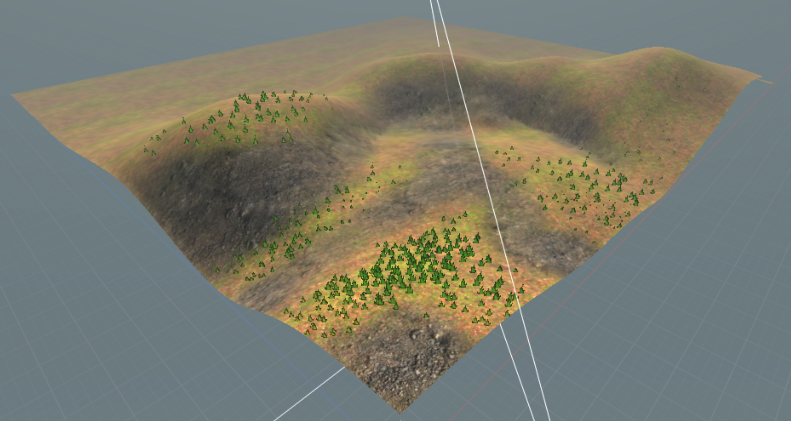

## 5. Add a tree prototype and place trees

1. In the Project panel, confirm that `tree_oak.glb` has finished importing. Expand the model asset if needed so you can see its mesh sub-assets. Select the model asset and set its **Unit Scale** to `3` so the tree size better matches the terrain.
   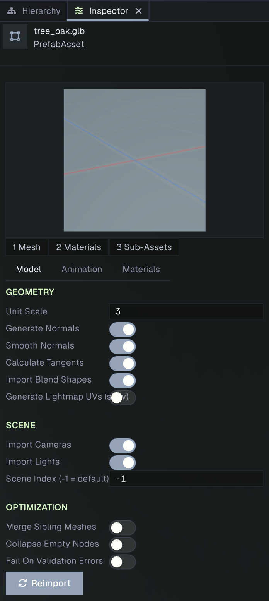
2. Select the terrain and open the **Trees** tab. Select **+** to add a tree prototype.
3. In the prototype settings, assign the imported oak **Mesh**. Use the asset picker and choose the mesh sub-asset from `tree_oak.glb`, not the model’s prefab/root asset. If the imported model has materials, assign them in the **Materials** slots shown below the Mesh field; otherwise Prowl uses the default Standard material.
4. Set **Bend Factor** to `0` for this first pass. The prototype is now available for placement.
5. Set **Brush Size** to around `18` and **Trees Per Stroke** to `1` or `2`.
   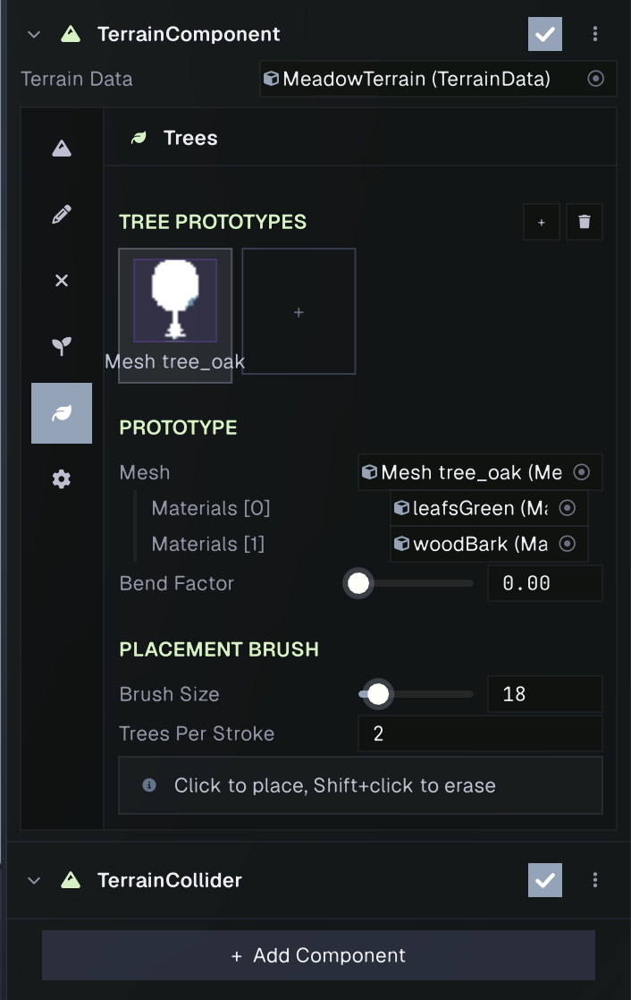
6. Click in the Scene View on the hills and around the clearing to place trees. Leave the center of the clearing and the path open. Keep clicks spaced apart to avoid crowding.
7. Hold **Shift** and click a tree you want to remove. Reduce **Brush Size** if the erase area is too broad.
8. Save with **Save to TerrainData**.

If the mesh is missing or the prototype remains named **Empty**, reopen the asset picker and select the mesh sub-asset. The terrain tree renderer expects a mesh, while the imported `.glb` file itself is a prefab containing that mesh.

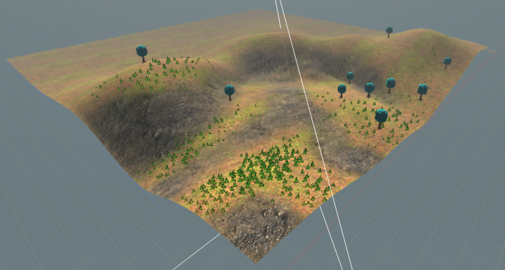

## 6. Tune vegetation visibility and save

1. Open the terrain’s **Settings** tab and find **Vegetation**.
2. Keep **Detail Distance** moderate (start around `100`) and **Tree View Distance** around `250`. These control how far the grass details and trees are drawn.
3. If the grass looks too dense, lower **Detail Density**. **Detail Cascades** reduces detail density farther from the camera; leave it at its default for now.
4. Look around the terrain in Scene View and check the result from the camera’s Game View. Adjust the paint or prototypes if vegetation blocks the path or hides the terrain shape.
5. Click **Save to TerrainData** if the Unsaved edits banner is visible, then save the scene.
   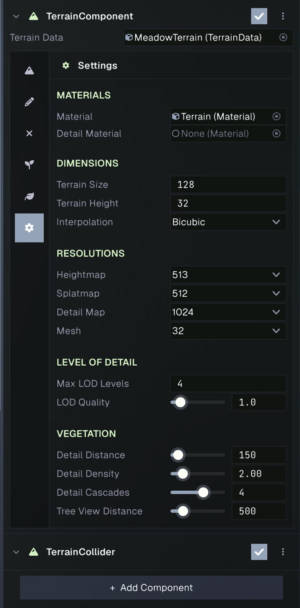

You now have a sculpted, textured terrain with painted foliage and placed trees. For more detail on the controls and terrain physics, see the [Terrain reference](../terrain/terrain.md).

## What you learned

Terrain shape, surface painting, foliage density, and tree placement are stored in a Terrain Data asset. The Terrain component provides separate tools for editing each part, while its Settings tab controls terrain dimensions, rendering, and vegetation distance. To keep a project organized, keep the Terrain Data asset and the source textures and models together under `Assets`.

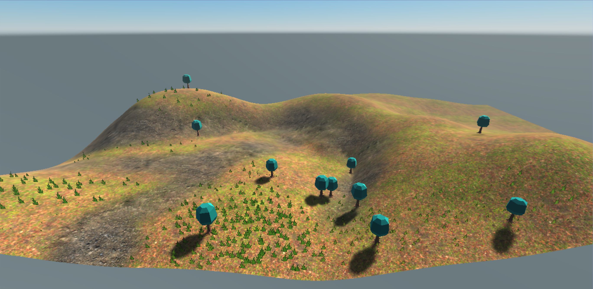
